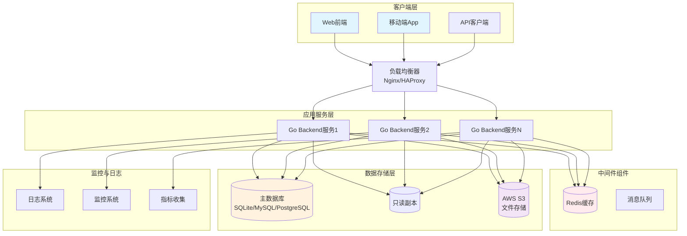
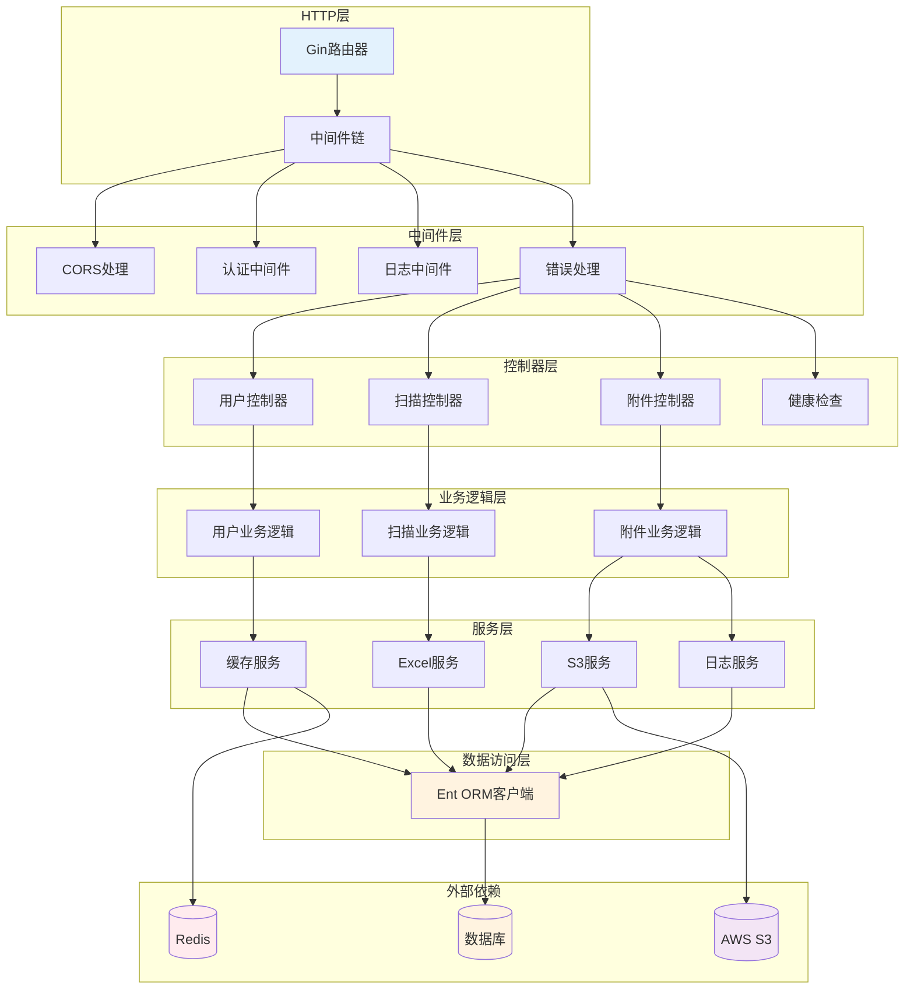
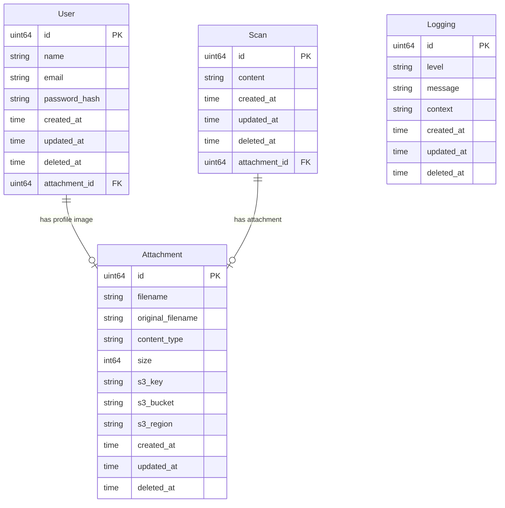
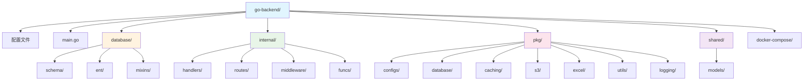
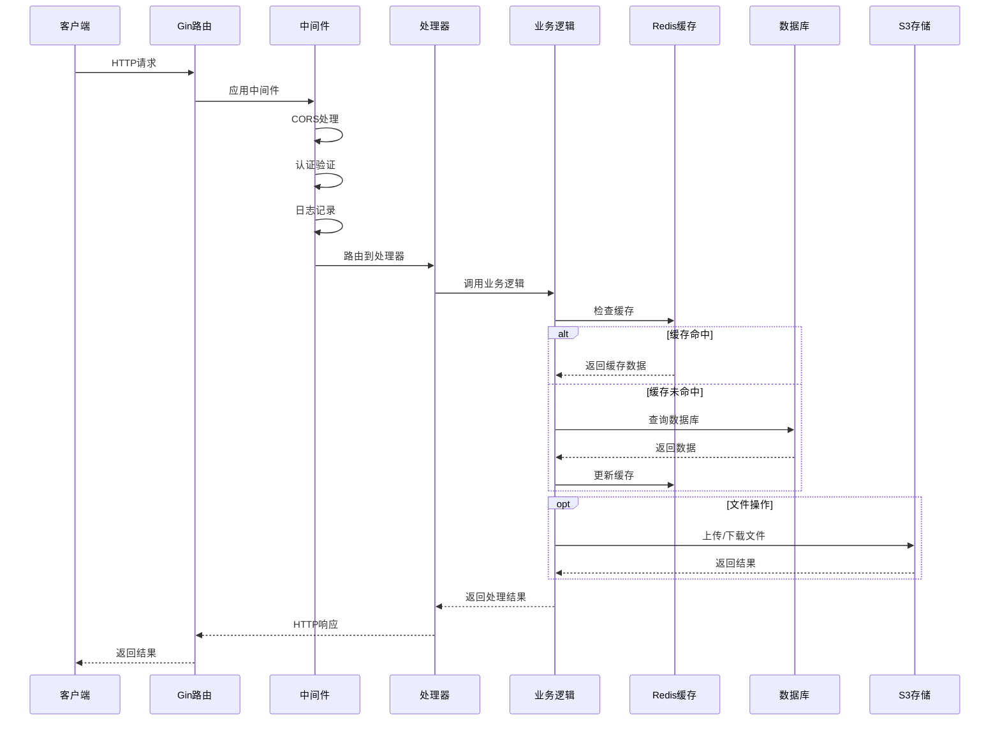
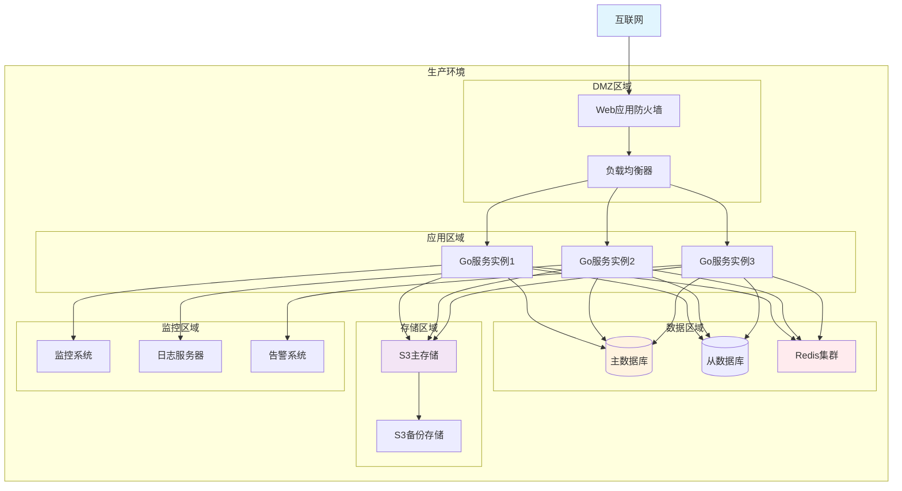
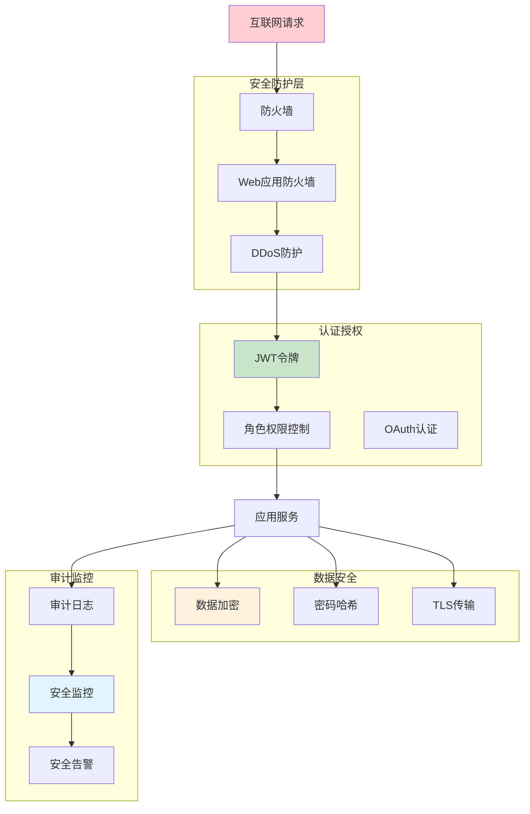

# Go Backend 模板架构文档

## 📖 架构概述

这是一个企业级Go后端项目模板的技术架构文档。模板采用分层架构设计，集成了现代Web开发的最佳实践，提供了完整的用户管理、文件处理、缓存等基础设施，并包含扫描管理作为业务逻辑示例。

## 🏗️ 设计理念

### 核心原则

1. **分层架构** - 清晰的职责分离
2. **依赖注入** - 低耦合，高内聚
3. **配置外部化** - 多环境支持
4. **错误集中处理** - 统一错误处理机制
5. **代码生成** - 减少重复劳动
6. **云原生** - 容器化和微服务友好

### 技术选择

- **Web框架**: Gin - 高性能，中间件丰富
- **ORM**: Ent - 类型安全，代码生成
- **缓存**: Redis - 高性能分布式缓存
- **存储**: S3 兼容 - 云存储标准
- **配置**: Viper - 多格式配置支持

## 技术架构图

## 应用内部架构

## 数据库设计

## 目录结构设计

## 请求处理流程

## 部署架构

## 安全架构

## 扩展性设计

系统采用分层架构和微服务设计原则，具备良好的扩展性：

1. **水平扩展**: 应用服务无状态设计，支持负载均衡
2. **垂直扩展**: 模块化设计，便于功能扩展
3. **存储扩展**: 支持主从复制、分库分表
4. **缓存扩展**: Redis集群支持
5. **文件存储**: 云存储服务，自动扩展

## 性能优化

1. **缓存策略**: 多级缓存设计
2. **数据库优化**: 读写分离、索引优化
3. **连接池**: 数据库连接池管理
4. **异步处理**: 文件上传、邮件发送等异步处理
5. **CDN加速**: 静态资源CDN分发

## 监控指标

- **应用指标**: 响应时间、吞吐量、错误率
- **系统指标**: CPU、内存、磁盘使用率
- **数据库指标**: 连接数、慢查询、锁等待
- **缓存指标**: 命中率、内存使用、连接数
- **业务指标**: 用户活跃度、功能使用情况
