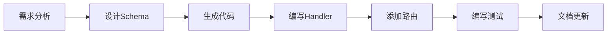
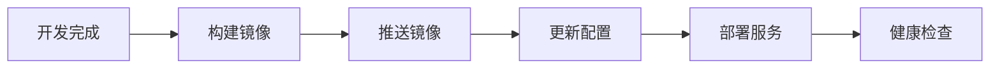

# 📚 Go Backend 模板文档总览

欢迎使用 Go Backend 项目模板！这里是所有文档的导航指南。

## 🗂️ 文档结构

### 📖 主要文档

| 文档名称 | 描述 | 适用人群 |
|---------|------|----------|
| [README.md](./README.md) | 项目概述和快速开始 | 所有用户 |
| [TEMPLATE_GUIDE.md](./TEMPLATE_GUIDE.md) | 详细的模板使用指南 | 开发者 |
| [ARCHITECTURE.md](./ARCHITECTURE.md) | 技术架构设计文档 | 架构师、高级开发者 |
| [DEPLOYMENT.md](./DEPLOYMENT.md) | 部署运维指南 | 运维工程师、DevOps |

### 📋 功能文档

| 文档名称 | 描述 | 相关模块 |
|---------|------|----------|
| [README_EXCEL_EXPORT.md](./README_EXCEL_EXPORT.md) | Excel导出功能说明 | 数据导出 |
| [README_UPLOAD_API.md](./README_UPLOAD_API.md) | 文件上传API文档 | 文件管理 |

## 🎯 根据角色选择文档

### 👨‍💻 开发者

如果您是开发者，建议按以下顺序阅读：

1. **[README.md](./README.md)** - 了解项目概述和技术栈
2. **[TEMPLATE_GUIDE.md](./TEMPLATE_GUIDE.md)** - 学习如何使用模板
3. **[ARCHITECTURE.md](./ARCHITECTURE.md)** - 深入了解架构设计
4. 功能文档 - 根据需要查阅特定功能

### 🏗️ 架构师

如果您是系统架构师，建议重点关注：

1. **[ARCHITECTURE.md](./ARCHITECTURE.md)** - 系统架构设计
2. **[README.md](./README.md)** - 技术栈和功能模块
3. **[DEPLOYMENT.md](./DEPLOYMENT.md)** - 部署架构

### 🚀 DevOps/运维工程师

如果您负责部署和运维，建议重点关注：

1. **[DEPLOYMENT.md](./DEPLOYMENT.md)** - 完整的部署指南
2. **[README.md](./README.md)** - 项目基础信息
3. **[ARCHITECTURE.md](./ARCHITECTURE.md)** - 了解系统组件

### 🆕 新手用户

如果您是第一次使用，建议：

1. **[README.md](./README.md)** - 从项目概述开始
2. **快速开始部分** - 先跑起来看看效果
3. **[TEMPLATE_GUIDE.md](./TEMPLATE_GUIDE.md)** - 详细学习如何定制

## 📋 快速导航

### 🚀 立即开始

```bash
# 1. 克隆项目
git clone <your-repo>
cd go-backend

# 2. 安装依赖
go mod download

# 3. 生成代码
go generate ./database/generate.go

# 4. 启动服务
go run main.go
```

访问 http://localhost:8080/health 检查服务状态。

### 🔧 常用操作

| 操作 | 命令 | 文档参考 |
|------|------|----------|
| 启动开发服务器 | `go run main.go -c config.dev.yaml` | [README.md](./README.md#快速开始) |
| 生成数据库代码 | `go generate ./database/generate.go` | [TEMPLATE_GUIDE.md](./TEMPLATE_GUIDE.md#添加新的业务实体) |
| 添加新实体 | 创建schema → 生成代码 → 添加handler | [TEMPLATE_GUIDE.md](./TEMPLATE_GUIDE.md#添加新的业务实体) |
| 部署到生产 | Docker或K8s部署 | [DEPLOYMENT.md](./DEPLOYMENT.md) |

### 📚 代码示例

| 功能 | 代码位置 | 说明 |
|------|----------|------|
| 用户管理 | `internal/handlers/user_handler.go` | 标准CRUD操作示例 |
| 文件上传 | `internal/handlers/attachment_handler.go` | S3文件上传示例 |
| 数据导出 | `internal/handlers/scan_handler.go` | Excel导出示例 |
| 中间件 | `internal/middleware/` | 错误处理、CORS等 |
| 配置管理 | `pkg/configs/` | 多环境配置 |

## 🔍 问题解决

### 常见问题

| 问题类型 | 查看文档 | 关键词 |
|---------|----------|--------|
| 安装和启动问题 | [README.md](./README.md) | 快速开始、环境要求 |
| 如何定制业务逻辑 | [TEMPLATE_GUIDE.md](./TEMPLATE_GUIDE.md) | 添加实体、自定义 |
| 部署相关问题 | [DEPLOYMENT.md](./DEPLOYMENT.md) | Docker、K8s、生产环境 |
| 架构理解 | [ARCHITECTURE.md](./ARCHITECTURE.md) | 系统设计、技术选择 |
| 文件上传问题 | [README_UPLOAD_API.md](./README_UPLOAD_API.md) | S3配置、上传流程 |

### 📞 获取帮助

1. **查看文档** - 首先查看相关文档
2. **检查配置** - 确认配置文件正确
3. **查看日志** - 检查应用程序日志
4. **提交Issue** - 在GitHub上提交问题
5. **参与讨论** - 加入社区讨论

## 🛠️ 开发工作流

### 新功能开发



详细步骤参考：[TEMPLATE_GUIDE.md](./TEMPLATE_GUIDE.md#添加新的业务实体)

### 部署流程



详细步骤参考：[DEPLOYMENT.md](./DEPLOYMENT.md)

## 📈 学习路径

### 初级开发者

1. 阅读 [README.md](./README.md) 了解项目
2. 跟随快速开始指南启动项目
3. 修改示例代码，理解项目结构
4. 阅读 [TEMPLATE_GUIDE.md](./TEMPLATE_GUIDE.md) 学习定制方法

### 中级开发者

1. 深入学习 [ARCHITECTURE.md](./ARCHITECTURE.md) 了解设计理念
2. 阅读源码，理解各层职责
3. 实践添加新的业务模块
4. 学习测试和部署

### 高级开发者

1. 分析架构设计的优缺点
2. 考虑性能优化和安全加固
3. 设计微服务拆分方案
4. 贡献代码和改进建议

## 🔄 文档维护

### 文档更新原则

- **及时性** - 代码变更后及时更新文档
- **准确性** - 确保文档与代码一致
- **完整性** - 覆盖主要功能和用例
- **易读性** - 使用清晰的语言和结构

### 贡献文档

我们欢迎您改进文档！请参考 [README.md](./README.md#贡献指南) 了解贡献流程。

---

## 📞 联系我们

- 🐛 [报告Bug](https://github.com/your-username/go-backend-template/issues)
- 💡 [功能建议](https://github.com/your-username/go-backend-template/discussions)
- 📧 邮件: your-email@example.com
- 💬 讨论群: [加入我们](https://your-chat-link)

---

**🎉 祝您使用愉快！如果文档有任何不清楚的地方，请随时联系我们。**
