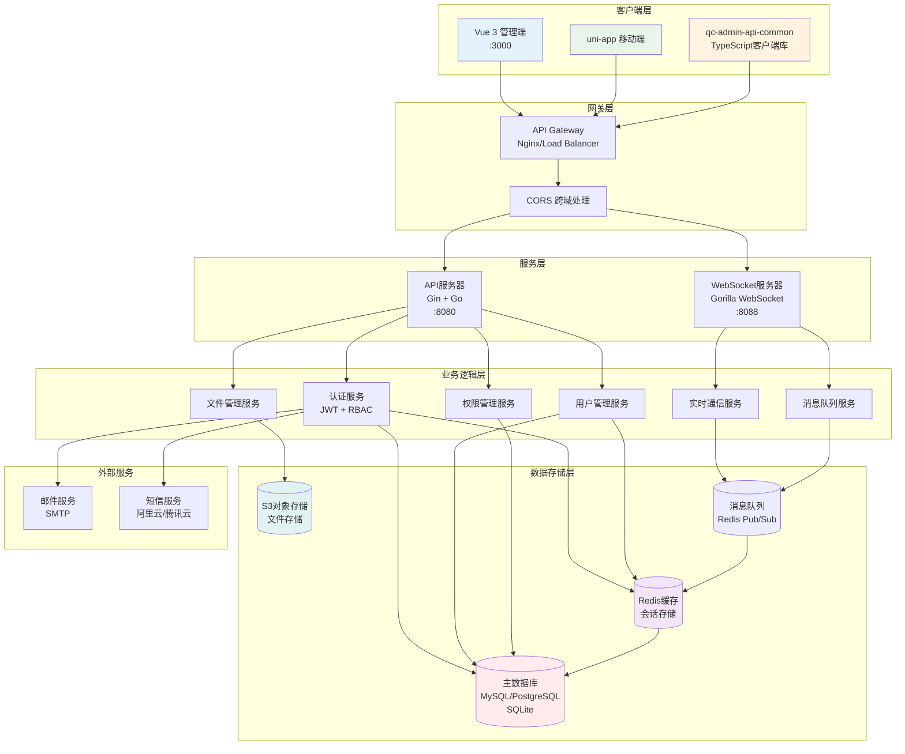
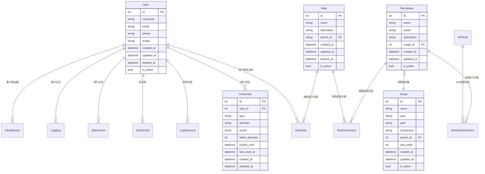
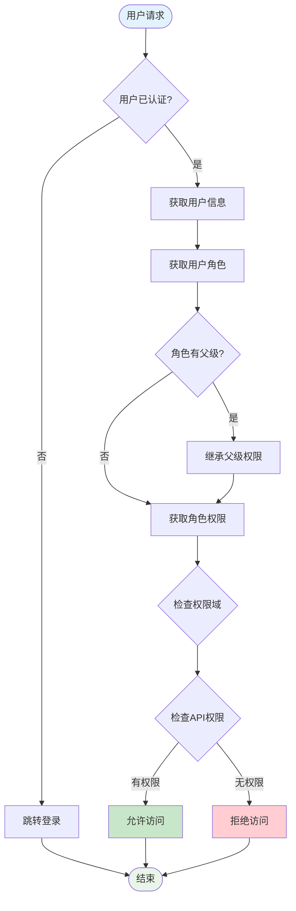
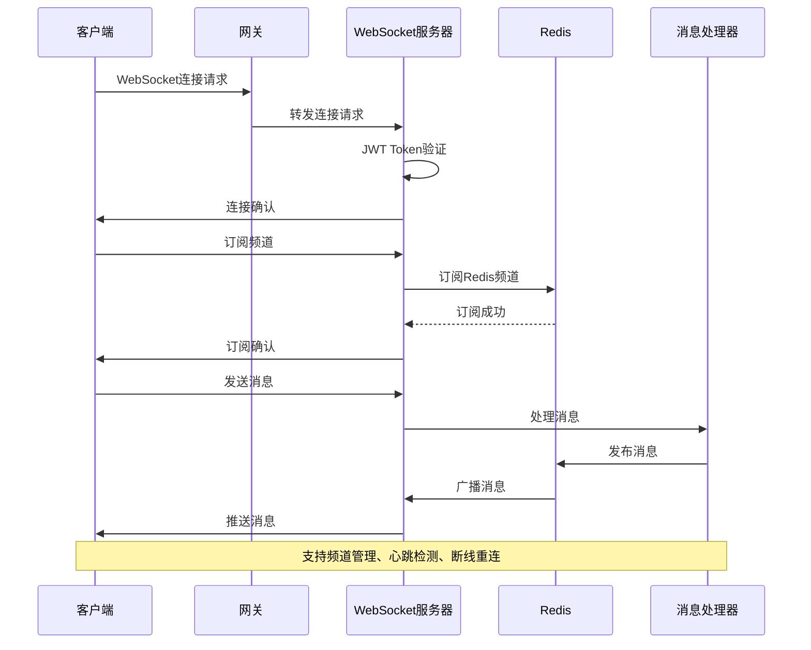
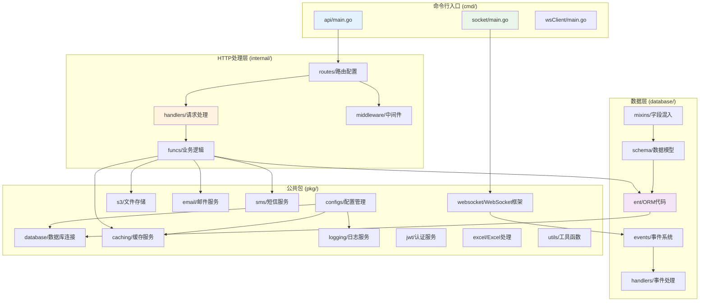
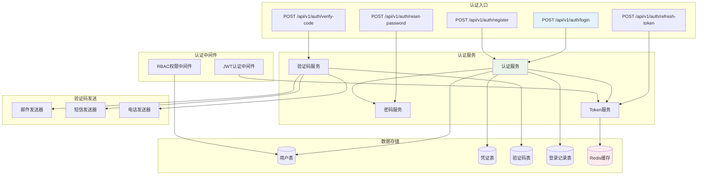
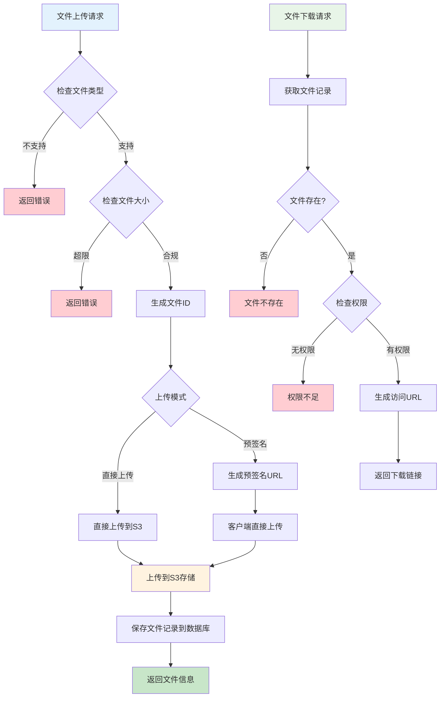

# QC Admin Go Backend

QC Admin 系统的高性能Go后端服务，采用现代化微服务架构设计。提供完整的企业级管理系统后端解决方案，支持Web管理端和移动端双重接入。

## 🚀 项目概述

QC Admin 是一个完整的企业级管理系统，由四个核心模块组成：

- **qc-admin**: Vue 3 + TypeScript 前端管理系统
- **qc-admin-app**: uni-app 跨平台移动端应用
- **qc-admin-go-backend**: Go + Gin 高性能后端服务（本项目）
- **qc-admin-api-common**: TypeScript 公共API客户端库

## ✨ 核心特性

### 🏗️ 架构设计

- **分层架构**: Handler → Service → Repository 清晰职责分离
- **事件驱动**: 基于发布订阅模式的事件系统，解耦业务逻辑
- **代码生成**: Ent ORM 自动生成类型安全的数据库操作代码
- **双服务架构**: API服务 + WebSocket服务分离部署

### 🔐 认证与权限

- **JWT认证**: 支持Token刷新机制，安全可靠
- **多种登录方式**: 密码登录、手机验证码、邮箱验证码
- **RBAC权限系统**: 角色权限管理，支持角色继承
- **API权限控制**: 细粒度的API访问控制
- **权限域管理**: 树形权限域结构，支持菜单、页面、按钮级权限

### 🌐 通信能力

- **RESTful API**: 标准的REST接口设计
- **WebSocket服务**: 实时双向通信，支持频道机制
- **多客户端支持**: 同时支持Web端和移动端接入
- **消息系统**: 基于Redis的消息队列和广播

### 🛡️ 安全特性

- **Argon2ID密码加密**: 防彩虹表攻击
- **登录安全**: 失败次数限制，账户锁定机制
- **数据验证**: 严格的请求参数验证
- **CORS配置**: 跨域请求安全控制
- **软删除**: 数据安全删除，支持恢复

### 🔧 企业级功能

- **用户管理**: 完整的用户生命周期管理
- **文件服务**: S3兼容的文件存储，支持云存储
- **数据导出**: Excel格式数据导出
- **系统监控**: 健康检查、性能监控
- **多数据库**: SQLite/MySQL/PostgreSQL/ClickHouse/Oracle/SQL Server

## 🏛️ 系统架构

### 整体架构图



### 数据库模型关系图



### RBAC权限系统流程图



### WebSocket通信架构图



## 📁 项目结构

```
qc-admin-go-backend/
├── cmd/                        # 命令行程序入口
│   ├── api/                    # API服务器
│   │   ├── main.go            # API服务器主程序
│   │   ├── config.go          # 配置加载
│   │   ├── db.go              # 数据库初始化
│   │   └── server.go          # 服务器启动逻辑
│   ├── socket/                # WebSocket服务器
│   │   ├── main.go            # Socket服务器主程序
│   │   ├── server.go          # Socket服务器逻辑
│   │   └── handlers/          # Socket消息处理器
│   └── wsClient/              # WebSocket客户端测试工具
├── configs/                   # 配置文件
│   ├── config.yaml           # 默认配置
│   ├── config.dev.yaml       # 开发环境配置
│   └── config.prod.yaml      # 生产环境配置
├── database/                  # 数据库相关
│   ├── ent/                   # Ent ORM生成代码
│   ├── events/                # 事件系统
│   ├── handlers/              # 数据库事件处理器
│   ├── mixins/                # 通用字段混入
│   └── schema/                # 数据表结构定义
├── internal/                  # 内部应用逻辑
│   ├── funcs/                 # 业务逻辑函数
│   ├── handlers/              # HTTP请求处理器
│   ├── middleware/            # 中间件
│   └── routes/                # 路由配置
├── pkg/                       # 可重用的公共包
│   ├── configs/               # 配置管理
│   ├── database/              # 数据库连接
│   ├── caching/               # 缓存服务
│   ├── logging/               # 日志服务
│   ├── s3/                    # S3文件存储
│   ├── email/                 # 邮件服务
│   ├── sms/                   # 短信服务
│   ├── jwt/                   # JWT服务
│   ├── excel/                 # Excel处理
│   ├── websocket/             # WebSocket框架
│   └── utils/                 # 工具函数
└── docs/                      # 文档目录
```

### 模块依赖关系图



### 认证系统架构图



### 文件管理系统流程图



## 🛠️ 技术栈

### 核心框架

- **Web框架**: [Gin](https://github.com/gin-gonic/gin) - 高性能HTTP Web框架
- **ORM**: [Ent](https://entgo.io/) - 类型安全的Go实体框架，支持代码生成
- **配置管理**: [Viper](https://github.com/spf13/viper) - 多格式配置文件支持
- **命令行**: [Cobra](https://github.com/spf13/cobra) - 强大的命令行应用框架

### 数据存储

- **数据库**: SQLite/MySQL/PostgreSQL/ClickHouse/Oracle/SQL Server 多数据库支持
- **缓存**: [Redis](https://redis.io/) - 分布式缓存和会话存储
- **文件存储**: [AWS S3](https://aws.amazon.com/s3/) - 云文件存储服务

### 通信组件

- **WebSocket**: [Gorilla WebSocket](https://github.com/gorilla/websocket) - WebSocket连接管理
- **消息队列**: 基于Redis的发布订阅机制
- **HTTP客户端**: 支持多种HTTP请求方式

### 安全组件

- **JWT**: [jwt-go](https://github.com/golang-jwt/jwt) - JSON Web Token实现
- **密码加密**: Argon2ID 算法
- **权限控制**: 自研RBAC权限系统

### 工具库

- **ID生成**: [Sony Flake](https://github.com/sony/sonyflake) - 分布式唯一ID生成器
- **Excel处理**: [Excelize](https://github.com/xuri/excelize) - Excel文件操作
- **邮件服务**: [Gomail](https://github.com/go-gomail/gomail) - 邮件发送
- **短信服务**: 阿里云、腾讯云短信接口

## 🚦 快速开始

### 环境要求

- Go 1.23+
- Redis 6.0+
- 数据库：SQLite（默认）/ MySQL 8.0+ / PostgreSQL 12+

### 安装依赖

```bash
# 克隆项目
git clone <repository-url>
cd qc-admin-go-backend

# 安装依赖
go mod download

# 生成数据库代码
go generate ./database/generate.go
```

### 配置文件

复制并编辑配置文件：

```bash
# 复制配置文件
cp config.example.yaml config.yaml
```

配置文件结构：

```yaml
server:
  host: "localhost"
  port: 8080
  mode: "debug"

socket:
  port: "localhost:8088"
  allow_origins: []

database:
  driver: "sqlite3"
  source: "ent.db"

redis:
  addr: "localhost:6379"
  password: ""
  db: 0

s3:
  endpoint: ""
  region: ""
  bucket: ""
  access_key: ""
  secret_key: ""

jwt:
  secret: "your-secret-key"
  expire_hours: 24

logging:
  level: "info"
  format: "json"
```

### 启动服务

```bash
# 启动API服务器（端口8080）
go run ./cmd/api

# 启动WebSocket服务器（端口8088）
go run ./cmd/socket

# 或者构建后运行
make build
./server-api
./server-socket
```

### 验证安装

```bash
# 检查API服务健康状态
curl http://localhost:8080/health

# 检查WebSocket连接
wscat -c ws://localhost:8088/ws
```

## 📚 API 文档

### 认证相关

| 方法 | 路径 | 说明 |
|------|------|------|
| POST | `/api/v1/auth/login` | 用户登录 |
| POST | `/api/v1/auth/register` | 用户注册 |
| POST | `/api/v1/auth/send-verify-code` | 发送验证码 |
| POST | `/api/v1/auth/verify-code` | 验证验证码 |
| POST | `/api/v1/auth/reset-password` | 重置密码 |
| POST | `/api/v1/auth/refresh-token` | 刷新Token |

### 用户管理

| 方法 | 路径 | 说明 |
|------|------|------|
| GET | `/api/v1/users` | 获取用户列表 |
| GET | `/api/v1/users/pagination` | 分页获取用户 |
| GET | `/api/v1/users/:id` | 获取单个用户 |
| POST | `/api/v1/users` | 创建用户 |
| PUT | `/api/v1/users/:id` | 更新用户 |
| DELETE | `/api/v1/users/:id` | 删除用户 |

### RBAC权限管理

| 方法 | 路径 | 说明 |
|------|------|------|
| GET | `/api/v1/rbac/roles` | 获取角色列表 |
| GET | `/api/v1/rbac/permissions` | 获取权限列表 |
| GET | `/api/v1/rbac/scopes` | 获取权限域树 |
| POST | `/api/v1/rbac/roles` | 创建角色 |
| PUT | `/api/v1/rbac/roles/:id` | 更新角色 |
| DELETE | `/api/v1/rbac/roles/:id` | 删除角色 |

### 文件管理

| 方法 | 路径 | 说明 |
|------|------|------|
| GET | `/api/v1/attachments` | 获取附件列表 |
| POST | `/api/v1/attachments/upload` | 直接上传文件 |
| POST | `/api/v1/attachments/prepare-upload` | 准备上传 |
| POST | `/api/v1/attachments/confirm-upload` | 确认上传 |
| GET | `/api/v1/attachments/:id/url` | 获取文件访问URL |

### 系统监控

| 方法 | 路径 | 说明 |
|------|------|------|
| GET | `/health` | 系统健康检查 |
| GET | `/api/v1/logging` | 获取系统日志 |

## 🔌 WebSocket API

### 连接说明

WebSocket服务运行在独立端口（默认8088），支持以下功能：

- **实时消息推送**: 服务器主动推送消息给客户端
- **频道机制**: 支持创建和管理通信频道
- **心跳检测**: 自动连接状态检测和重连
- **多客户端**: 同时支持Web端和移动端连接

### 连接示例

```javascript
// Web端连接
const ws = new WebSocket('ws://localhost:8088/ws?token=your-jwt-token');

ws.onopen = function() {
    console.log('WebSocket连接已建立');
};

ws.onmessage = function(event) {
    const data = JSON.parse(event.data);
    console.log('收到消息:', data);
};
```

### 消息格式

```json
{
  "action": "message_type",
  "topic": "channel_name",
  "data": {
    "content": "message content"
  }
}
```

## 🏗️ 开发指南

### 添加新的API接口

1. **定义数据模型** (database/schema/)

```go
// database/schema/product.go
package schema

import (
    "go-backend/database/mixins"
    "entgo.io/ent"
    "entgo.io/ent/schema/field"
)

type Product struct {
    ent.Schema
}

func (Product) Mixin() []ent.Mixin {
    return []ent.Mixin{
        mixins.BaseMixin{},
    }
}

func (Product) Fields() []ent.Field {
    return []ent.Field{
        field.String("name").NotEmpty(),
        field.String("description").Optional(),
        field.Float("price").Positive(),
    }
}
```

2. **生成ORM代码**

```bash
go generate ./database/generate.go
```

3. **创建业务逻辑** (internal/funcs/)

```go
// internal/funcs/product_func.go
package funcs

func CreateProduct(ctx context.Context, req CreateProductRequest) (*ent.Product, error) {
    return client.Product.Create().
        SetName(req.Name).
        SetDescription(req.Description).
        SetPrice(req.Price).
        Save(ctx)
}
```

4. **创建HTTP处理器** (internal/handlers/)

```go
// internal/handlers/product_handler.go
package handlers

func (h *ProductHandler) CreateProduct(c *gin.Context) {
    var req CreateProductRequest
    if err := c.ShouldBindJSON(&req); err != nil {
        middleware.ThrowError(c, middleware.ValidationError("参数错误", err.Error()))
        return
    }
    
    product, err := funcs.CreateProduct(middleware.GetRequestContext(c), req)
    if err != nil {
        middleware.ThrowError(c, middleware.BusinessError("创建失败", err.Error()))
        return
    }
    
    c.JSON(200, gin.H{"success": true, "data": product})
}
```

5. **注册路由** (internal/routes/)

```go
// internal/routes/product.go
package routes

func RegisterProductRoutes(r *gin.RouterGroup) {
    handler := handlers.NewProductHandler()
    
    products := r.Group("/products")
    {
        products.GET("", handler.GetProducts)
        products.POST("", handler.CreateProduct)
        products.GET("/:id", handler.GetProduct)
        products.PUT("/:id", handler.UpdateProduct)
        products.DELETE("/:id", handler.DeleteProduct)
    }
}
```

### 添加WebSocket消息处理

1. **创建消息处理器** (cmd/socket/handlers/)

```go
// cmd/socket/handlers/custom_handler.go
func handleCustomMessage(message messaging.MessageStruct) error {
    // 处理自定义消息逻辑
    return nil
}

func registerCustomHandler(ws *websocket.WsServer) {
    messaging.RegisterHandler("custom_topic", handleCustomMessage)
}
```

2. **注册处理器**

```go
// cmd/socket/handlers/handlers.go
func RegisterHandlers(ws *websocket.WsServer) {
    registerSocketHandler(ws)
    registerCustomHandler(ws)  // 添加新的处理器
}
```

### 数据库迁移

项目使用Ent ORM的自动迁移功能：

```go
// 在应用启动时自动迁移
if err := client.Schema.Create(context.Background()); err != nil {
    log.Fatalf("failed creating schema resources: %v", err)
}
```

### 添加中间件

```go
// internal/middleware/custom.go
package middleware

func CustomMiddleware() gin.HandlerFunc {
    return func(c *gin.Context) {
        // 中间件逻辑
        c.Next()
    }
}
```

## 🧪 测试

### 运行测试

```bash
# 运行所有测试
go test ./...

# 运行特定包的测试
go test ./internal/handlers

# 运行测试并生成覆盖率报告
go test -coverprofile=coverage.out ./...
go tool cover -html=coverage.out
```

### API测试

项目提供了完整的API测试用例，参考文档：

- [认证系统测试指南](./README_AUTH.md)
- [RBAC权限测试指南](./RBAC_API_TEST_GUIDE.md)

## 🚀 部署

### Docker部署

```bash
# 构建镜像
docker build -t qc-admin-backend .

# 运行容器
docker run -d \
  --name qc-admin-api \
  -p 8080:8080 \
  -v $(pwd)/config.yaml:/app/config.yaml \
  qc-admin-backend

# 运行WebSocket服务
docker run -d \
  --name qc-admin-socket \
  -p 8088:8088 \
  -v $(pwd)/config.yaml:/app/config.yaml \
  qc-admin-backend ./server-socket
```

### 生产环境部署

1. **编译应用**

```bash
# 编译API服务器
go build -o server-api ./cmd/api

# 编译WebSocket服务器
go build -o server-socket ./cmd/socket
```

2. **配置生产环境**

```yaml
# config.prod.yaml
server:
  host: "0.0.0.0"
  port: 8080
  mode: "release"

database:
  driver: "mysql"
  source: "user:password@tcp(localhost:3306)/qc_admin?charset=utf8mb4&parseTime=True&loc=Local"

redis:
  addr: "redis-server:6379"
  password: "your-redis-password"

logging:
  level: "warn"
  format: "json"
```

3. **系统服务配置**

```ini
# /etc/systemd/system/qc-admin-api.service
[Unit]
Description=QC Admin API Server
After=network.target

[Service]
Type=simple
User=qc-admin
WorkingDirectory=/opt/qc-admin
ExecStart=/opt/qc-admin/server-api -c config.prod.yaml
Restart=always
RestartSec=5

[Install]
WantedBy=multi-user.target
```

### 监控和日志

- **健康检查**: `GET /health` 端点
- **Prometheus监控**: 可集成Prometheus metrics
- **日志收集**: 结构化JSON日志，支持ELK Stack
- **性能监控**: 内置性能指标统计

## 📖 相关文档

- [架构设计文档](./ARCHITECTURE.md) - 深入的技术架构说明
- [认证开发总结](./AUTH_DEVELOPMENT_SUMMARY.md) - 认证系统详细说明
- [RBAC实现总结](./RBAC_IMPLEMENTATION_SUMMARY.md) - 权限系统实现细节
- [Excel导出说明](./README_EXCEL_EXPORT.md) - Excel功能使用说明
- [文件上传API](./README_UPLOAD_API.md) - 文件上传接口文档
- [数据库驱动支持](./DATABASE_DRIVERS.md) - 数据库驱动配置说明

## 🤝 贡献指南

欢迎贡献代码！请遵循以下步骤：

1. Fork 项目
2. 创建功能分支 (`git checkout -b feature/AmazingFeature`)
3. 提交更改 (`git commit -m 'Add some AmazingFeature'`)
4. 推送到分支 (`git push origin feature/AmazingFeature`)
5. 打开 Pull Request

### 代码规范

- 遵循Go官方代码规范
- 使用 `gofmt` 格式化代码
- 添加必要的注释和文档
- 确保测试通过
- 提交消息请使用英文，格式清晰

## 📄 许可证

本项目采用 [MIT 许可证](LICENSE)。

## 🙏 致谢

感谢以下开源项目：

- [Gin Web Framework](https://github.com/gin-gonic/gin)
- [Ent ORM](https://entgo.io/)
- [Viper](https://github.com/spf13/viper)
- [Redis](https://redis.io/)
- [Go语言社区](https://golang.org/)

---

如有问题或建议，请创建 [Issue](https://github.com/your-username/qc-admin-go-backend/issues)。