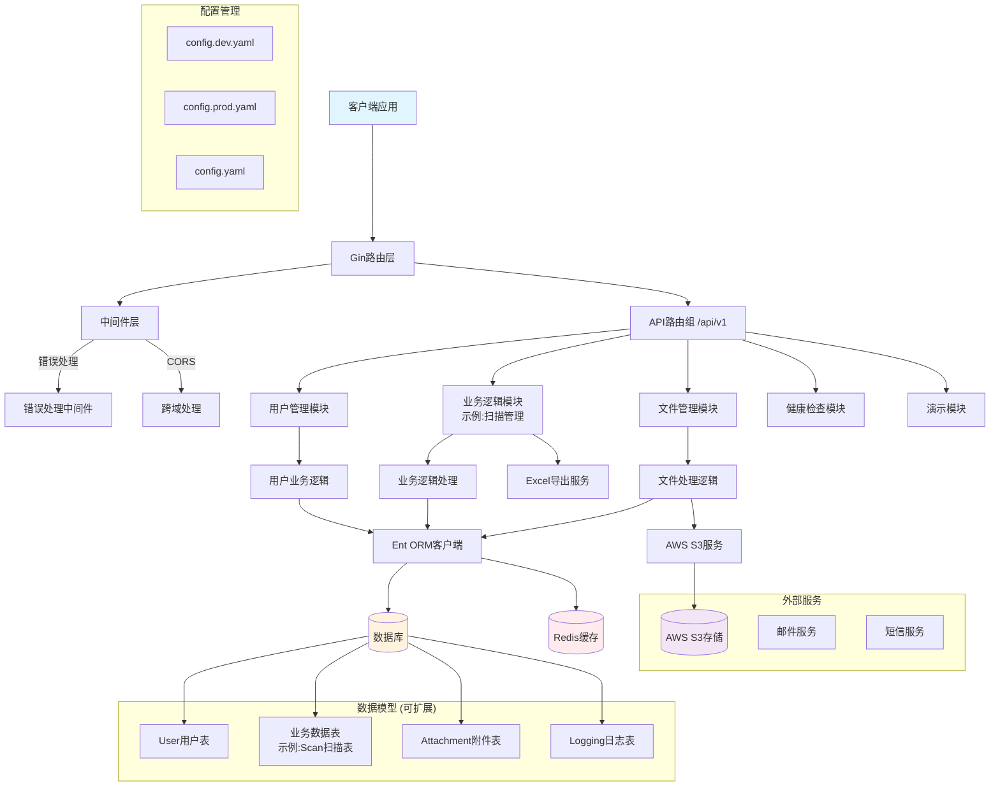
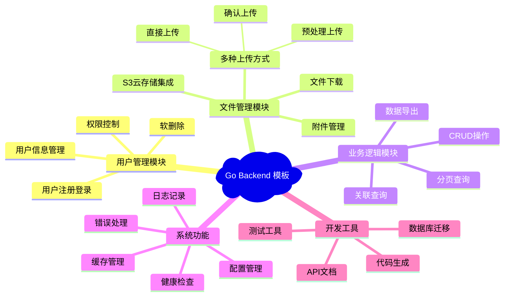

# Go Backend 项目模板

这是一个功能完整的Go后端项目模板，采用现代化的技术栈和最佳实践。内置扫描管理系统作为示例，展示了如何构建企业级的RESTful API服务。模板包含用户管理、文件上传、数据导出、缓存等常用功能模块。

## 🚀 特性

### 🏗️ 架构特性
- **分层架构设计**: Controller → Service → Repository 清晰分层
- **依赖注入**: 低耦合，高内聚的模块设计
- **代码生成**: Ent ORM 自动生成类型安全的数据库操作代码
- **配置外部化**: 支持多环境配置，生产就绪

### 🔧 功能特性
- **用户管理**: 完整的用户CRUD、软删除、分页查询
- **文件上传**: 支持S3云存储，多种上传策略
- **数据导出**: Excel格式数据导出功能
- **缓存系统**: Redis分布式缓存支持
- **健康检查**: 内置监控端点，支持负载均衡器健康检查

### 🛡️ 安全特性
- **统一错误处理**: 防止敏感信息泄露
- **CORS支持**: 跨域请求安全控制
- **输入验证**: 请求参数验证和清理
- **软删除**: 数据安全删除，支持恢复

### 🚀 运维特性
- **Docker支持**: 容器化部署，云原生架构
- **多数据库支持**: SQLite/MySQL/PostgreSQL
- **结构化日志**: JSON格式日志，便于分析
- **优雅关闭**: 支持优雅的服务停止

## 模板架构图



## 模板功能模块



## 项目结构

```text
go-backend/
├── config.yaml                # 默认配置文件
├── config.dev.yaml            # 开发环境配置
├── config.prod.yaml           # 生产环境配置
├── main.go                    # 应用程序入口
├── go.mod                     # Go模块依赖
├── go.sum                     # 依赖校验
├── Makefile                   # 构建脚本
├── server.exe                 # 编译后的可执行文件
├── ent.db                     # SQLite数据库文件
│
├── database/                  # 数据库相关
│   ├── generate.go            # Ent代码生成
│   ├── ent/                   # Ent ORM生成的代码
│   │   ├── client.go          # 数据库客户端
│   │   ├── *.go               # 实体CRUD操作
│   │   └── schema/            # 数据表结构
│   ├── mixins/                # 通用字段混入
│   │   └── base.go            # 基础字段定义
│   └── schema/                # 实体模式定义
│       ├── user.go            # 用户表结构
│       ├── scan.go            # 扫描表结构
│       ├── attachment.go      # 附件表结构
│       └── logging.go         # 日志表结构
│
├── internal/                  # 内部应用逻辑
│   ├── handlers/              # HTTP请求处理器
│   │   ├── user_handler.go    # 用户管理接口
│   │   ├── scan_handler.go    # 扫描内容接口
│   │   ├── attachment_handler.go # 附件管理接口
│   │   ├── health_handler.go  # 健康检查接口
│   │   └── demo_handler.go    # 演示接口
│   ├── middleware/            # 中间件
│   │   ├── error_handler.go   # 错误处理中间件
│   │   └── errors.go          # 错误定义
│   ├── routes/                # 路由配置
│   │   ├── routes.go          # 主路由配置
│   │   ├── user.go            # 用户路由
│   │   ├── scan.go            # 扫描路由
│   │   ├── attachment.go      # 附件路由
│   │   └── demo.go            # 演示路由
│   └── funcs/                 # 业务逻辑函数
│       ├── userfunc.go        # 用户业务逻辑
│       ├── scanfunc.go        # 扫描业务逻辑
│       ├── attachmentfunc.go  # 附件业务逻辑
│       ├── loggingfunc.go     # 日志业务逻辑
│       └── redisfunc.go       # Redis操作
│
├── pkg/                       # 公共包
│   ├── configs/               # 配置管理
│   │   ├── config.go          # 配置结构定义
│   │   ├── database.go        # 数据库配置
│   │   ├── logging.go         # 日志配置
│   │   ├── redis.go           # Redis配置
│   │   ├── s3.go              # S3配置
│   │   └── server.go          # 服务器配置
│   ├── database/              # 数据库连接
│   │   └── database.go        # 数据库初始化
│   ├── caching/               # 缓存服务
│   │   └── cache.go           # Redis缓存操作
│   ├── logging/               # 日志服务
│   │   └── logger.go          # 日志记录器
│   ├── s3/                    # S3文件存储
│   │   └── s3.go              # AWS S3操作
│   ├── excel/                 # Excel处理
│   │   ├── excel.go           # Excel导出功能
│   │   └── excel_test.go      # Excel测试
│   └── utils/                 # 工具函数
│       ├── id.go              # ID生成工具
│       └── time.go            # 时间处理工具
│
├── shared/                    # 共享模型
│   └── models/                # 数据模型定义
│       ├── base.go            # 基础模型
│       ├── user.go            # 用户模型
│       ├── scan.go            # 扫描模型
│       └── attachment.go      # 附件模型
│
├── docker-compose/            # Docker配置
│   ├── dependency.yaml        # 依赖服务配置
│   └── README.md              # Docker说明
│
└── tmp/                       # 临时文件
    ├── build-errors.log       # 构建错误日志
    └── main*                  # 临时编译文件
```

## 技术栈

### 核心框架
- **Web框架**: [Gin](https://github.com/gin-gonic/gin) - 高性能HTTP Web框架
- **ORM**: [Ent](https://entgo.io/) - 类型安全的Go实体框架，支持代码生成
- **配置管理**: [Viper](https://github.com/spf13/viper) - 多格式配置文件支持

### 数据存储
- **数据库**: SQLite/MySQL/PostgreSQL (支持多种数据库)
- **缓存**: [Redis](https://redis.io/) - 分布式缓存和会话存储
- **文件存储**: [AWS S3](https://aws.amazon.com/s3/) - 云文件存储服务

### 工具库
- **ID生成**: [Sony Flake](https://github.com/sony/sonyflake) - 分布式唯一ID生成器
- **Excel处理**: Excel文件导入导出功能
- **日志**: 结构化JSON日志记录
- **CORS**: 跨域请求支持

### 开发工具
- **代码生成**: Ent schema代码自动生成
- **热重载**: 支持开发时自动重启
- **Docker**: 容器化部署支持
- **Makefile**: 自动化构建脚本

## API 接口

### 健康检查

- `GET /health` - 系统健康检查

### 用户管理

- `GET /api/v1/users` - 获取所有用户
├── go.sum                     # Go依赖锁定文件
├── Makefile                   # 构建脚本
└── README.md                  # 项目说明
```

## 架构设计

### 分层架构

1. **Handler Layer (处理器层)**: 处理HTTP请求和响应
2. **Service Layer (服务层)**: 包含业务逻辑
3. **Repository Layer (仓储层)**: 由Ent ORM提供，处理数据访问

### 目录说明

- **`configs/`**: 应用配置管理，包括数据库配置、服务器配置等
- **`internal/`**: 内部应用代码，不对外暴露
  - **`handlers/`**: HTTP请求处理器，负责处理路由和HTTP相关逻辑
  - **`services/`**: 业务逻辑服务，包含核心业务逻辑
  - **`routes/`**: 路由配置，集中管理所有API路由
- **`pkg/`**: 可重用的公共包，可以被其他项目引用
- **`shared/`**: 共享的类型定义、模型等
- **`ent/`**: Ent ORM生成的代码

## 快速开始

### 安装依赖

```bash
make init
```

### 运行应用

```bash
# 开发模式运行
make run

# 或者使用热重载（需要先安装air）
go install github.com/cosmtrek/air@latest
make dev
```

### 构建应用

```bash
make build
```

## 示例API接口

> 以下是模板中内置的示例API，展示了常见的业务功能实现

### 系统接口

- `GET /health` - 系统健康检查

### 用户管理示例

- `GET /api/v1/users` - 获取所有用户
- `GET /api/v1/users/pagination` - 分页获取用户列表
- `GET /api/v1/users/:id` - 根据ID获取单个用户
- `POST /api/v1/users` - 创建新用户
- `PUT /api/v1/users/:id` - 更新用户信息
- `DELETE /api/v1/users/:id` - 删除用户（软删除）

### 业务数据示例 (扫描管理)

- `GET /api/v1/scans` - 获取所有扫描记录
- `GET /api/v1/scans/pagination` - 分页获取扫描记录
- `GET /api/v1/scans/:id` - 根据ID获取单个扫描记录
- `POST /api/v1/scans` - 创建新扫描记录
- `PUT /api/v1/scans/:id` - 更新扫描记录
- `DELETE /api/v1/scans/:id` - 删除扫描记录（软删除）
- `GET /api/v1/scans/export` - 导出扫描记录到Excel

### 文件管理示例

- `GET /api/v1/attachments` - 获取所有附件
- `GET /api/v1/attachments/pagination` - 分页获取附件列表
- `GET /api/v1/attachments/:id` - 根据ID获取单个附件
- `POST /api/v1/attachments` - 创建新附件记录
- `PUT /api/v1/attachments/:id` - 更新附件信息
- `DELETE /api/v1/attachments/:id` - 删除附件
- `GET /api/v1/attachments/:id/url` - 获取附件访问URL
- `POST /api/v1/attachments/prepare-upload` - 准备文件上传
- `POST /api/v1/attachments/confirm-upload` - 确认文件上传
- `POST /api/v1/attachments/upload` - 直接上传文件

## 模板使用指南

### 🎯 如何使用此模板

1. **克隆模板**
   ```bash
   git clone <repository-url>
   cd go-backend
   ```

2. **自定义项目信息**
   - 修改 `go.mod` 中的模块名
   - 更新配置文件中的项目相关信息
   - 根据需要调整数据库配置

3. **替换示例业务逻辑**
   - 删除或修改 `database/schema/scan.go` (示例业务实体)
   - 删除或修改 `internal/handlers/scan_handler.go`
   - 删除或修改 `internal/routes/scan.go`
   - 删除或修改 `internal/funcs/scanfunc.go`

4. **添加自己的业务模块**
   - 在 `database/schema/` 中定义新的实体
   - 在 `internal/handlers/` 中添加处理器
   - 在 `internal/routes/` 中添加路由
   - 在 `internal/funcs/` 中添加业务逻辑

### 📋 保留的核心功能

以下功能建议保留作为基础设施：

- ✅ **用户管理模块** - 大部分应用都需要用户系统
- ✅ **文件管理模块** - 通用的文件上传下载功能
- ✅ **健康检查** - 系统监控必备
- ✅ **中间件系统** - 错误处理、CORS等
- ✅ **配置管理** - 多环境配置支持
- ✅ **日志系统** - 应用日志记录

### 🔄 可替换的示例功能

以下是示例功能，可根据业务需要替换：

- 🔄 **扫描管理** - 替换为您的核心业务逻辑
- 🔄 **Excel导出** - 根据需要保留或移除
- 🔄 **演示接口** - 开发完成后可删除

## 环境配置

项目支持多环境配置，通过不同的配置文件管理：

- `config.yaml` - 默认配置
- `config.dev.yaml` - 开发环境配置  
- `config.prod.yaml` - 生产环境配置

### 配置文件结构

```yaml
server:
  host: "localhost"
  port: 8080
  mode: "debug"

database:
  driver: "sqlite3"
  source: "ent.db"

redis:
  addr: "localhost:6379"
  password: ""
  db: 0

s3:
  endpoint: ""
  region: ""
  bucket: ""
  access_key: ""
  secret_key: ""

logging:
  level: "info"
  format: "json"
```

## 快速开始

### 1. 安装依赖

```bash
go mod download
```

### 2. 生成数据库代码

```bash
go generate ./database/generate.go
```

### 3. 启动应用

```bash
# 使用默认配置
go run main.go

# 使用开发环境配置
go run main.go -c config.dev.yaml

# 使用生产环境配置  
go run main.go --config config.prod.yaml
```

### 4. 编译部署

```bash
# 编译
go build -o server.exe .

# 运行
./server.exe -c config.prod.yaml
```

## 开发指南

### 🏗️ 添加新的业务实体

1. **定义数据模型**
   ```bash
   # 在 database/schema/ 目录下创建新的schema文件
   touch database/schema/product.go
   ```

2. **编写Schema定义**
   ```go
   // database/schema/product.go
   package schema

   import (
       "go-backend/database/mixins"
       "entgo.io/ent"
       "entgo.io/ent/schema/field"
   )

   type Product struct {
       ent.Schema
   }

   func (Product) Mixin() []ent.Mixin {
       return []ent.Mixin{
           mixins.BaseMixin{},
           mixins.SoftDeleteMixin{},
       }
   }

   func (Product) Fields() []ent.Field {
       return []ent.Field{
           field.String("name").NotEmpty(),
           field.Text("description").Optional(),
           field.Float("price").Positive(),
       }
   }
   ```

3. **生成ORM代码**
   ```bash
   go generate ./database/generate.go
   ```

4. **创建业务逻辑层**
   ```bash
   # 创建处理器
   touch internal/handlers/product_handler.go
   
   # 创建业务逻辑函数
   touch internal/funcs/productfunc.go
   
   # 创建路由配置
   touch internal/routes/product.go
   
   # 创建数据模型
   touch shared/models/product.go
   ```

5. **注册路由**
   ```go
   // 在 internal/routes/routes.go 中添加
   r.setupProductRoutes(api)
   ```

### 🔧 自定义中间件

```go
// internal/middleware/auth.go
package middleware

import (
    "net/http"
    "github.com/gin-gonic/gin"
)

func AuthMiddleware() gin.HandlerFunc {
    return func(c *gin.Context) {
        // 实现认证逻辑
        token := c.GetHeader("Authorization")
        if token == "" {
            c.JSON(http.StatusUnauthorized, gin.H{"error": "未提供认证token"})
            c.Abort()
            return
        }
        
        // 验证token逻辑...
        
        c.Next()
    }
}
```

### 📊 数据库迁移

项目使用Ent ORM的自动迁移功能：

```go
// 在应用启动时自动迁移
client, err := ent.Open(driverName, dataSourceName)
if err != nil {
    log.Fatalf("failed opening connection to database: %v", err)
}

// 自动迁移schema
if err := client.Schema.Create(context.Background()); err != nil {
    log.Fatalf("failed creating schema resources: %v", err)
}
```

### 🧪 添加测试

```go
// internal/handlers/product_handler_test.go
package handlers

import (
    "testing"
    "net/http/httptest"
    "github.com/gin-gonic/gin"
    "github.com/stretchr/testify/assert"
)

func TestProductHandler_GetProducts(t *testing.T) {
    gin.SetMode(gin.TestMode)
    
    w := httptest.NewRecorder()
    c, _ := gin.CreateTestContext(w)
    
    handler := NewProductHandler()
    handler.GetProducts(c)
    
    assert.Equal(t, 200, w.Code)
}
```

### 🔍 代码质量工具

```bash
# 格式化代码
go fmt ./...

# 运行测试
go test ./...

# 静态分析 (需要安装golangci-lint)
golangci-lint run

# 生成代码覆盖率报告
go test -coverprofile=coverage.out ./...
go tool cover -html=coverage.out
```

## 部署说明

### Docker部署

项目提供了Docker Compose配置文件用于部署依赖服务：

```bash
cd docker-compose
docker-compose -f dependency.yaml up -d
```

### 生产环境

1. 配置生产环境的 `config.prod.yaml`
2. 编译应用程序：`go build -o server.exe .`
3. 配置反向代理（Nginx）
4. 设置进程管理（systemd/supervisor）
5. 配置日志轮转

## 监控和日志

- 应用日志：结构化JSON格式日志
- 健康检查：`GET /health` 端点
- 错误追踪：统一错误处理和记录
- 性能监控：可集成Prometheus metrics

## 主要依赖库

### 核心依赖
- **[Gin](https://github.com/gin-gonic/gin)** - HTTP Web框架
- **[Ent](https://entgo.io/)** - 类型安全的Go实体框架
- **[Viper](https://github.com/spf13/viper)** - 配置管理库
- **[Redis](https://github.com/redis/go-redis)** - Redis客户端
- **[AWS SDK](https://github.com/aws/aws-sdk-go-v2)** - AWS服务集成

### 工具依赖
- **[Sony Flake](https://github.com/sony/sonyflake)** - 分布式ID生成器
- **[Color](https://github.com/fatih/color)** - 控制台彩色输出
- **[CORS](https://github.com/gin-contrib/cors)** - 跨域请求处理

## 📚 相关文档

- 📖 [模板使用手册](./TEMPLATE_GUIDE.md) - 详细的模板使用指南
- 🏗️ [架构设计文档](./ARCHITECTURE.md) - 深入的技术架构说明
- 📋 [Excel导出说明](./README_EXCEL_EXPORT.md) - Excel功能使用说明
- 📤 [文件上传API](./README_UPLOAD_API.md) - 文件上传接口文档

## 🤝 贡献指南

我们欢迎您为这个模板项目做出贡献！

### 贡献方式

1. **Fork** 项目仓库
2. **创建** 特性分支 (`git checkout -b feature/AmazingFeature`)
3. **提交** 更改 (`git commit -m 'Add some AmazingFeature'`)
4. **推送** 到分支 (`git push origin feature/AmazingFeature`)
5. **创建** Pull Request

### 贡献内容

- 🐛 Bug修复
- ✨ 新功能添加
- 📚 文档改进
- 🧪 测试用例
- 🔧 性能优化
- 🎨 代码重构

### 代码规范

- 遵循Go官方代码规范
- 添加必要的注释和文档
- 确保测试通过
- 保持提交消息清晰明了

## 📄 许可证

本项目采用 [MIT 许可证](LICENSE)。您可以自由使用、修改和分发此模板。

## 🙏 致谢

感谢以下开源项目和社区：

- [Gin Web Framework](https://github.com/gin-gonic/gin)
- [Ent ORM](https://entgo.io/)
- [Go语言社区](https://golang.org/)
- 所有贡献者和使用者

---

<div align="center">

**⭐ 如果这个模板对您有帮助，请给我们一个Star！**

[项目主页](https://github.com/your-username/go-backend-template) | [问题反馈](https://github.com/your-username/go-backend-template/issues) | [讨论区](https://github.com/your-username/go-backend-template/discussions)

</div>
