# QC Admin Go Backend

QC Admin 系统的高性能Go后端服务，采用现代化微服务架构设计。提供完整的企业级管理系统后端解决方案，支持Web管理端和移动端双重接入。

[👉 前端项目地址（qc-admin）](https://github.com/pqcqaq/qc-admin)

## 🚀 项目概述

QC Admin 是一个完整的企业级管理系统，由四个核心模块组成：

- **qc-admin**: Vue 3 + TypeScript 前端管理系统
- **qc-admin-app**: uni-app 跨平台移动端应用
- **qc-admin-go-backend**: Go + Gin 高性能后端服务（本项目）
- **qc-admin-api-common**: TypeScript 公共API客户端库

## 📸 截图

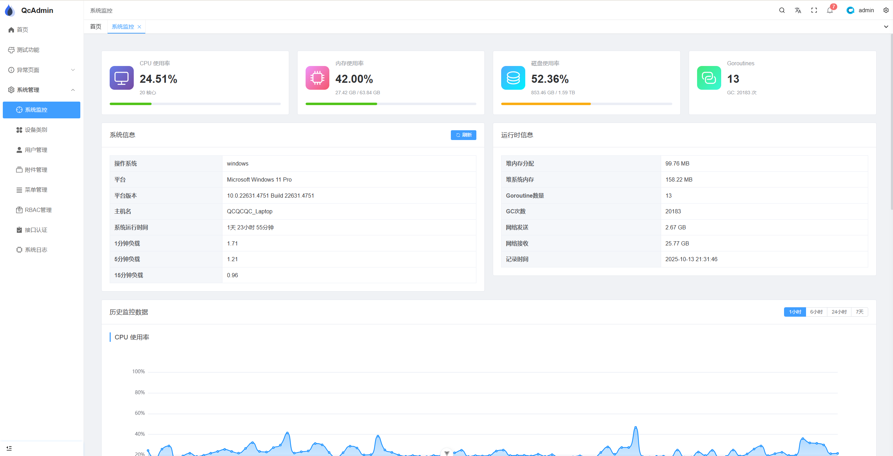
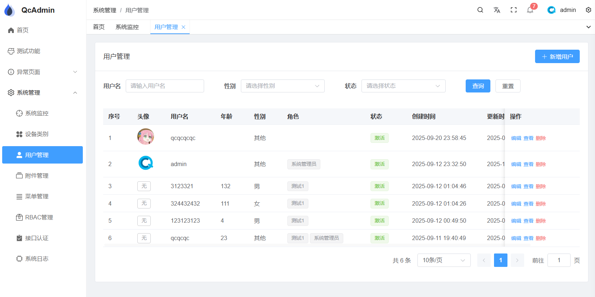
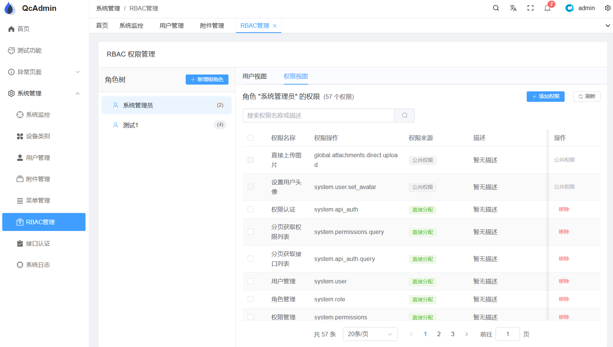
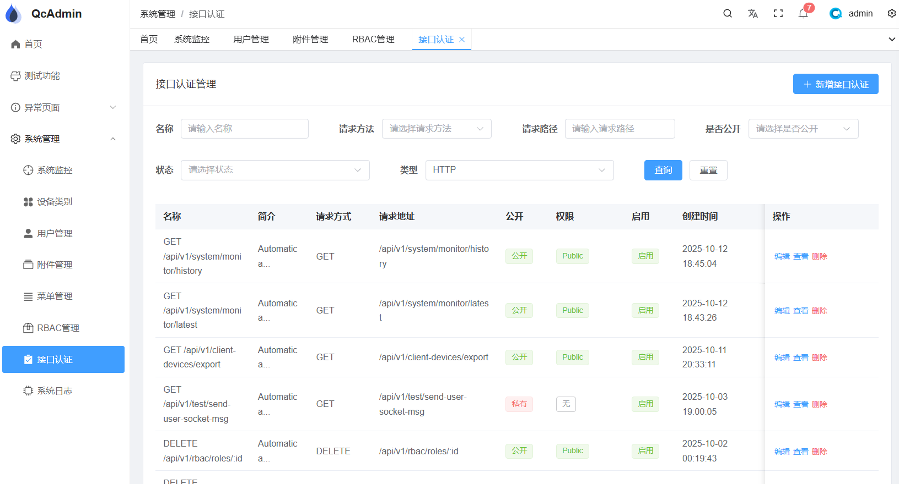
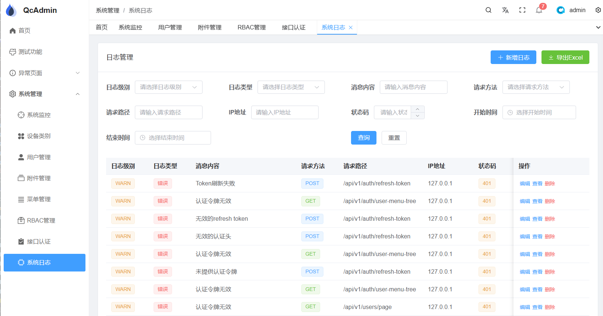
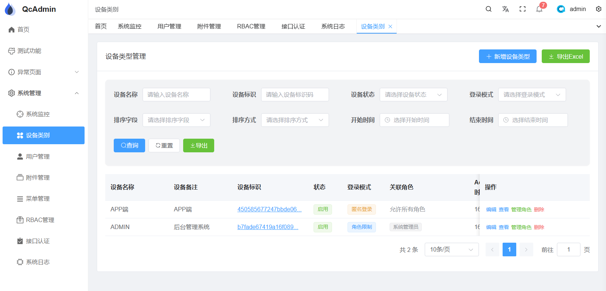

## ✨ 核心特性

### 🏗️ 架构设计

- **分层架构**: Handler → Service → Repository 清晰职责分离
- **事件驱动**: 基于发布订阅模式的事件系统，解耦业务逻辑
- **代码生成**: Ent ORM 自动生成类型安全的数据库操作代码
- **双服务架构**: API服务 + WebSocket服务分离部署

### 🔐 认证与权限

- **JWT认证**: 支持Token刷新机制，安全可靠
- **多种登录方式**: 密码登录、手机验证码、邮箱验证码
- **RBAC权限系统**: 角色权限管理，支持角色继承
- **API权限控制**: 细粒度的API访问控制
- **权限域管理**: 树形权限域结构，支持菜单、页面、按钮级权限

### 🌐 通信能力

- **RESTful API**: 标准的REST接口设计
- **WebSocket服务**: 实时双向通信，支持频道机制
- **多客户端支持**: 同时支持Web端和移动端接入
- **消息系统**: 基于Redis的消息队列和广播

### 🛡️ 安全特性

- **Argon2ID密码加密**: 防彩虹表攻击
- **登录安全**: 失败次数限制，账户锁定机制
- **数据验证**: 严格的请求参数验证
- **CORS配置**: 跨域请求安全控制
- **软删除**: 数据安全删除，支持恢复

### 🔧 企业级功能

- **用户管理**: 完整的用户生命周期管理
- **文件服务**: S3兼容的文件存储，支持云存储
- **数据导出**: Excel格式数据导出
- **系统监控**: 健康检查、性能监控
- **多数据库**: SQLite/MySQL/PostgreSQL/ClickHouse/Oracle/SQL Server

## 🏛️ 系统架构

### 整体架构图

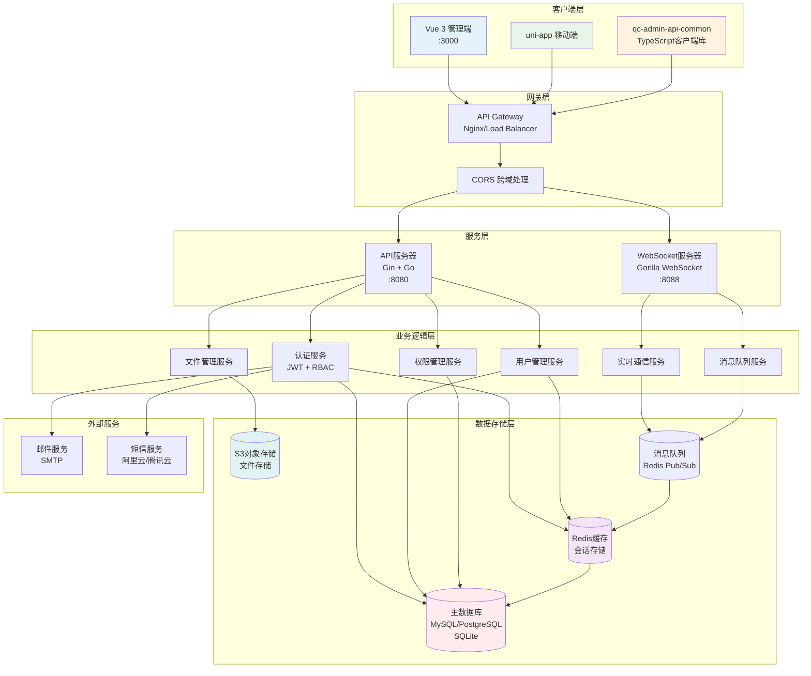

### 数据库模型关系图

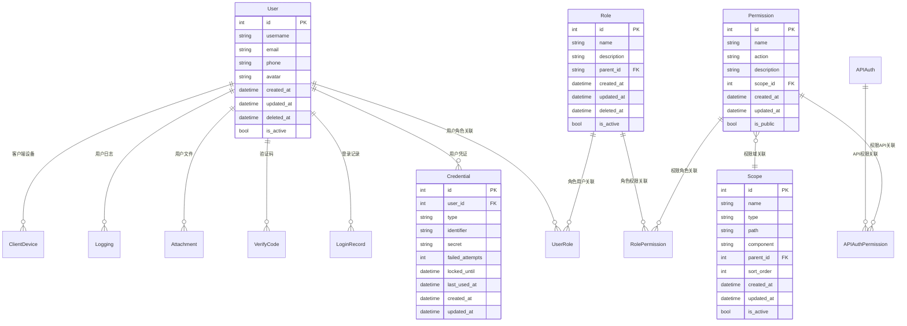

### RBAC权限系统流程图


### WebSocket通信架构图

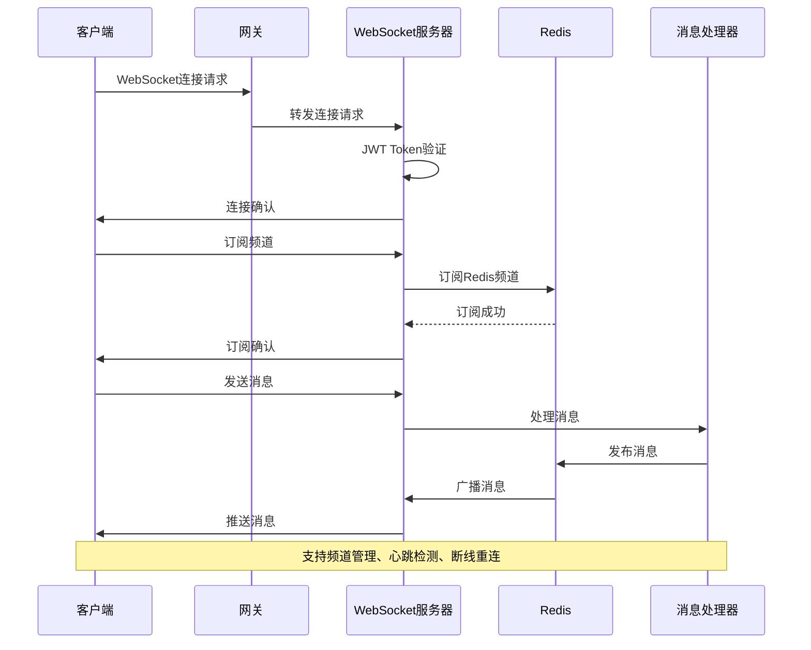

## 📁 项目结构

```
qc-admin-go-backend/
├── cmd/                        # 命令行程序入口
│   ├── api/                    # API服务器
│   │   ├── main.go            # API服务器主程序
│   │   ├── config.go          # 配置加载
│   │   ├── db.go              # 数据库初始化
│   │   └── server.go          # 服务器启动逻辑
│   ├── socket/                # WebSocket服务器
│   │   ├── main.go            # Socket服务器主程序
│   │   ├── server.go          # Socket服务器逻辑
│   │   └── handlers/          # Socket消息处理器
│   └── wsClient/              # WebSocket客户端测试工具
├── configs/                   # 配置文件
│   ├── config.yaml           # 默认配置
│   ├── config.dev.yaml       # 开发环境配置
│   └── config.prod.yaml      # 生产环境配置
├── database/                  # 数据库相关
│   ├── ent/                   # Ent ORM生成代码
│   ├── events/                # 事件系统
│   ├── handlers/              # 数据库事件处理器
│   ├── mixins/                # 通用字段混入
│   └── schema/                # 数据表结构定义
├── internal/                  # 内部应用逻辑
│   ├── funcs/                 # 业务逻辑函数
│   ├── handlers/              # HTTP请求处理器
│   ├── middleware/            # 中间件
│   └── routes/                # 路由配置
├── pkg/                       # 可重用的公共包
│   ├── configs/               # 配置管理
│   ├── database/              # 数据库连接
│   ├── caching/               # 缓存服务
│   ├── logging/               # 日志服务
│   ├── s3/                    # S3文件存储
│   ├── email/                 # 邮件服务
│   ├── sms/                   # 短信服务
│   ├── jwt/                   # JWT服务
│   ├── excel/                 # Excel处理
│   ├── websocket/             # WebSocket框架
│   └── utils/                 # 工具函数
└── docs/                      # 文档目录
```

### 模块依赖关系图

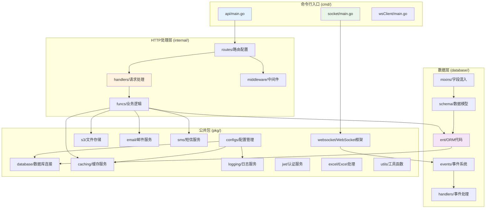

### 认证系统架构图

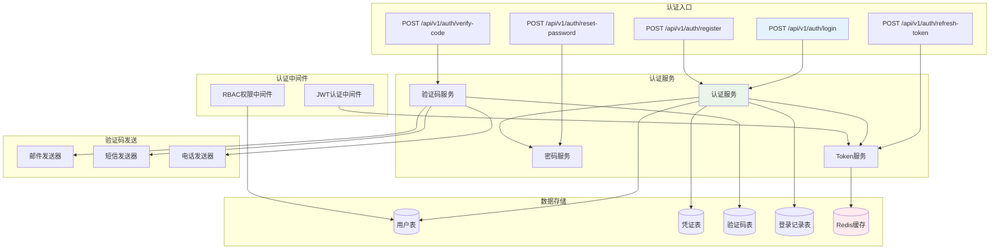

### 文件管理系统流程图

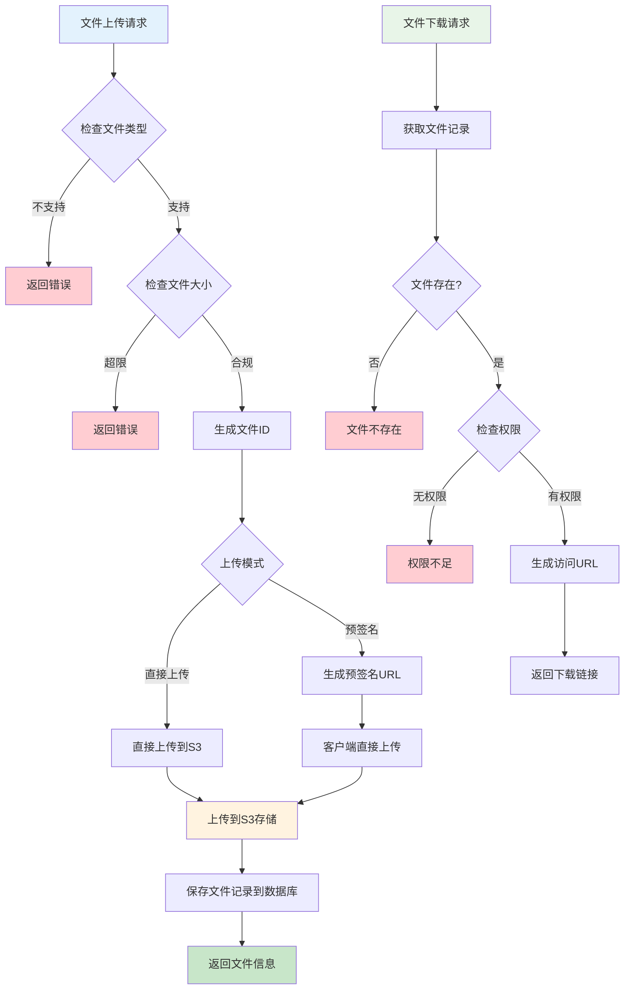

## 🛠️ 技术栈

### 核心框架

- **Web框架**: [Gin](https://github.com/gin-gonic/gin) - 高性能HTTP Web框架
- **ORM**: [Ent](https://entgo.io/) - 类型安全的Go实体框架，支持代码生成
- **配置管理**: [Viper](https://github.com/spf13/viper) - 多格式配置文件支持
- **命令行**: [Cobra](https://github.com/spf13/cobra) - 强大的命令行应用框架

### 数据存储

- **数据库**: SQLite/MySQL/PostgreSQL/ClickHouse/Oracle/SQL Server 多数据库支持
- **缓存**: [Redis](https://redis.io/) - 分布式缓存和会话存储
- **文件存储**: [AWS S3](https://aws.amazon.com/s3/) - 云文件存储服务

### 通信组件

- **WebSocket**: [Gorilla WebSocket](https://github.com/gorilla/websocket) - WebSocket连接管理
- **消息队列**: 基于Redis的发布订阅机制
- **HTTP客户端**: 支持多种HTTP请求方式

### 安全组件

- **JWT**: [jwt-go](https://github.com/golang-jwt/jwt) - JSON Web Token实现
- **密码加密**: Argon2ID 算法
- **权限控制**: 自研RBAC权限系统

### 工具库

- **ID生成**: [Sony Flake](https://github.com/sony/sonyflake) - 分布式唯一ID生成器
- **Excel处理**: [Excelize](https://github.com/xuri/excelize) - Excel文件操作
- **邮件服务**: [Gomail](https://github.com/go-gomail/gomail) - 邮件发送
- **短信服务**: 阿里云、腾讯云短信接口

## 🚦 快速开始

### 环境要求

- Go 1.23+
- Redis 6.0+
- 数据库：SQLite（默认）/ MySQL 8.0+ / PostgreSQL 12+

### 安装依赖

```bash
# 克隆项目
git clone <repository-url>
cd qc-admin-go-backend

# 安装依赖
go mod download

# 生成数据库代码
go generate ./database/generate.go
```

### 配置文件

复制并编辑配置文件：

```bash
# 复制配置文件
cp config.example.yaml config.yaml
```

配置文件结构：

```yaml
server:
  host: "localhost"
  port: 8080
  mode: "debug"

socket:
  port: "localhost:8088"
  allow_origins: []

database:
  driver: "sqlite3"
  source: "ent.db"

redis:
  addr: "localhost:6379"
  password: ""
  db: 0

s3:
  endpoint: ""
  region: ""
  bucket: ""
  access_key: ""
  secret_key: ""

jwt:
  secret: "your-secret-key"
  expire_hours: 24

logging:
  level: "info"
  format: "json"
```

### 启动服务

```bash
# 启动API服务器（端口8080）
go run ./cmd/api

# 启动WebSocket服务器（端口8088）
go run ./cmd/socket

# 或者构建后运行
make build
./server-api
./server-socket
```

### 验证安装

```bash
# 检查API服务健康状态
curl http://localhost:8080/health

# 检查WebSocket连接
wscat -c ws://localhost:8088/ws
```

## 🛠️ 服务编译与启动

### API 服务器

API服务器提供RESTful API接口，负责处理业务逻辑、数据库操作和文件管理等功能。

#### 编译

```bash
# 编译API服务器
go build -o server-api ./cmd/api

# 编译带版本信息
go build -ldflags "-X main.Version=1.0.0 -X main.BuildTime=$(date +%FT%T%z)" -o server-api ./cmd/api

# 跨平台编译（Linux）
GOOS=linux GOARCH=amd64 go build -o server-api-linux ./cmd/api

# 跨平台编译（Windows）
GOOS=windows GOARCH=amd64 go build -o server-api.exe ./cmd/api
```

#### 启动参数

```bash
# 使用默认配置启动（config.yaml）
go run ./cmd/api

# 指定配置文件
go run ./cmd/api -c config.prod.yaml
go run ./cmd/api --config config.dev.yaml

# 指定数据库迁移模式
go run ./cmd/api -m auto       # 自动执行数据库迁移
go run ./cmd/api -m check      # 检查但不执行迁移（默认）
go run ./cmd/api -m skip       # 跳过迁移检查
go run ./cmd/api --migrate auto

# 指定服务器端口（覆盖配置文件）
go run ./cmd/api -p 8080
go run ./cmd/api --port :8080

# 指定日志级别
go run ./cmd/api -l debug      # debug|info|warn|error
go run ./cmd/api --log-level info

# 指定Gin运行模式
go run ./cmd/api -g release    # debug|release|test
go run ./cmd/api --gin-mode debug

# 组合使用多个参数
go run ./cmd/api -c config.prod.yaml -m auto -p 8080 -l warn -g release
```

#### 命令行参数说明

| 参数 | 短格式 | 默认值 | 说明 |
|------|--------|--------|------|
| `--config` | `-c` | `config.yaml` | 配置文件路径 |
| `--migrate` | `-m` | `check` | 数据库迁移模式：`skip`（跳过）、`auto`（自动执行）、`check`（仅检查） |
| `--port` | `-p` | - | 服务器端口（覆盖配置文件），例如：`8080` 或 `:8080` |
| `--log-level` | `-l` | - | 日志级别（覆盖配置文件）：`debug`、`info`、`warn`、`error` |
| `--gin-mode` | `-g` | - | Gin运行模式（覆盖配置文件）：`debug`、`release`、`test` |

#### 使用示例

```bash
# 开发环境启动
go run ./cmd/api -c config.dev.yaml -m auto -l debug -g debug

# 生产环境启动
go run ./cmd/api -c config.prod.yaml -m skip -l warn -g release -p 8080

# 测试环境启动
go run ./cmd/api -c config.test.yaml -m auto -l info -g test
```

### WebSocket 服务器

WebSocket服务器提供实时双向通信能力，支持消息推送、频道管理和在线状态同步。

#### 编译

```bash
# 编译WebSocket服务器
go build -o server-socket ./cmd/socket

# 编译带版本信息
go build -ldflags "-X main.Version=1.0.0 -X main.BuildTime=$(date +%FT%T%z)" -o server-socket ./cmd/socket

# 跨平台编译（Linux）
GOOS=linux GOARCH=amd64 go build -o server-socket-linux ./cmd/socket

# 跨平台编译（Windows）
GOOS=windows GOARCH=amd64 go build -o server-socket.exe ./cmd/socket
```

#### 启动参数

```bash
# 使用默认配置启动（config.yaml）
go run ./cmd/socket

# 指定配置文件
go run ./cmd/socket -c config.prod.yaml
go run ./cmd/socket --config config.dev.yaml

# 指定服务器端口（覆盖配置文件）
go run ./cmd/socket -p 8088
go run ./cmd/socket --port :8088

# 指定日志级别
go run ./cmd/socket -l debug      # debug|info|warn|error
go run ./cmd/socket --log-level info

# 组合使用多个参数
go run ./cmd/socket -c config.prod.yaml -p 8088 -l warn
```

#### 命令行参数说明

| 参数 | 短格式 | 默认值 | 说明 |
|------|--------|--------|------|
| `--config` | `-c` | `config.yaml` | 配置文件路径 |
| `--port` | `-p` | - | 服务器端口（覆盖配置文件），例如：`8088` 或 `:8088` |
| `--log-level` | `-l` | - | 日志级别（覆盖配置文件）：`debug`、`info`、`warn`、`error` |

#### 使用示例

```bash
# 开发环境启动
go run ./cmd/socket -c config.dev.yaml -l debug

# 生产环境启动
go run ./cmd/socket -c config.prod.yaml -l warn -p 8088

# 测试环境启动
go run ./cmd/socket -c config.test.yaml -l info
```

### 同时运行两个服务

在开发环境中，你需要同时运行API服务器和WebSocket服务器：

```bash
# 在两个终端窗口分别运行

# 终端1: 启动API服务器
go run ./cmd/api -c config.dev.yaml -m auto -l debug

# 终端2: 启动WebSocket服务器
go run ./cmd/socket -c config.dev.yaml -l debug
```

或使用后台运行方式：

```bash
# 启动API服务器（后台）
nohup go run ./cmd/api -c config.yaml > api.log 2>&1 &

# 启动WebSocket服务器（后台）
nohup go run ./cmd/socket -c config.yaml > socket.log 2>&1 &

# 查看运行状态
ps aux | grep "go run"

# 查看日志
tail -f api.log
tail -f socket.log
```

### 使用systemd管理服务（Linux）

创建服务文件以便系统管理：

#### API服务

```ini
# /etc/systemd/system/qc-admin-api.service
[Unit]
Description=QC Admin API Server
After=network.target mysql.service redis.service

[Service]
Type=simple
User=qc-admin
WorkingDirectory=/opt/qc-admin
ExecStart=/opt/qc-admin/server-api -c /opt/qc-admin/config.prod.yaml -m check -g release
Restart=always
RestartSec=5
StandardOutput=journal
StandardError=journal

[Install]
WantedBy=multi-user.target
```

#### WebSocket服务

```ini
# /etc/systemd/system/qc-admin-socket.service
[Unit]
Description=QC Admin WebSocket Server
After=network.target redis.service

[Service]
Type=simple
User=qc-admin
WorkingDirectory=/opt/qc-admin
ExecStart=/opt/qc-admin/server-socket -c /opt/qc-admin/config.prod.yaml
Restart=always
RestartSec=5
StandardOutput=journal
StandardError=journal

[Install]
WantedBy=multi-user.target
```

#### 管理服务

```bash
# 重新加载systemd配置
sudo systemctl daemon-reload

# 启动服务
sudo systemctl start qc-admin-api
sudo systemctl start qc-admin-socket

# 设置开机自启
sudo systemctl enable qc-admin-api
sudo systemctl enable qc-admin-socket

# 查看服务状态
sudo systemctl status qc-admin-api
sudo systemctl status qc-admin-socket

# 停止服务
sudo systemctl stop qc-admin-api
sudo systemctl stop qc-admin-socket

# 重启服务
sudo systemctl restart qc-admin-api
sudo systemctl restart qc-admin-socket

# 查看日志
sudo journalctl -u qc-admin-api -f
sudo journalctl -u qc-admin-socket -f
```

## 🔌 WebSocket 通信

### 连接说明

WebSocket服务运行在独立端口（默认8088），支持以下功能：

- **实时消息推送**: 服务器主动推送消息给客户端
- **频道机制**: 支持创建和管理通信频道
- **心跳检测**: 自动连接状态检测和重连
- **多客户端**: 同时支持Web端和移动端连接

### 连接示例

```javascript
// Web端连接
const ws = new WebSocket('ws://localhost:8088/ws?token=your-jwt-token');

ws.onopen = function() {
    console.log('WebSocket连接已建立');
};

ws.onmessage = function(event) {
    const data = JSON.parse(event.data);
    console.log('收到消息:', data);
};
```

### 消息格式

```json
{
  "action": "message_type",
  "topic": "channel_name",
  "data": {
    "content": "message content"
  }
}
```

## 📦 PKG 包详细介绍

本项目将核心功能封装为可重用的pkg包,每个包都有明确的职责和独立的功能。以下是各个包的详细说明。

### pkg/messaging - 消息队列系统

消息队列系统是WebSocket服务和业务逻辑之间的桥梁，通过Redis作为消息中间件实现完全解耦的架构。

#### 架构设计

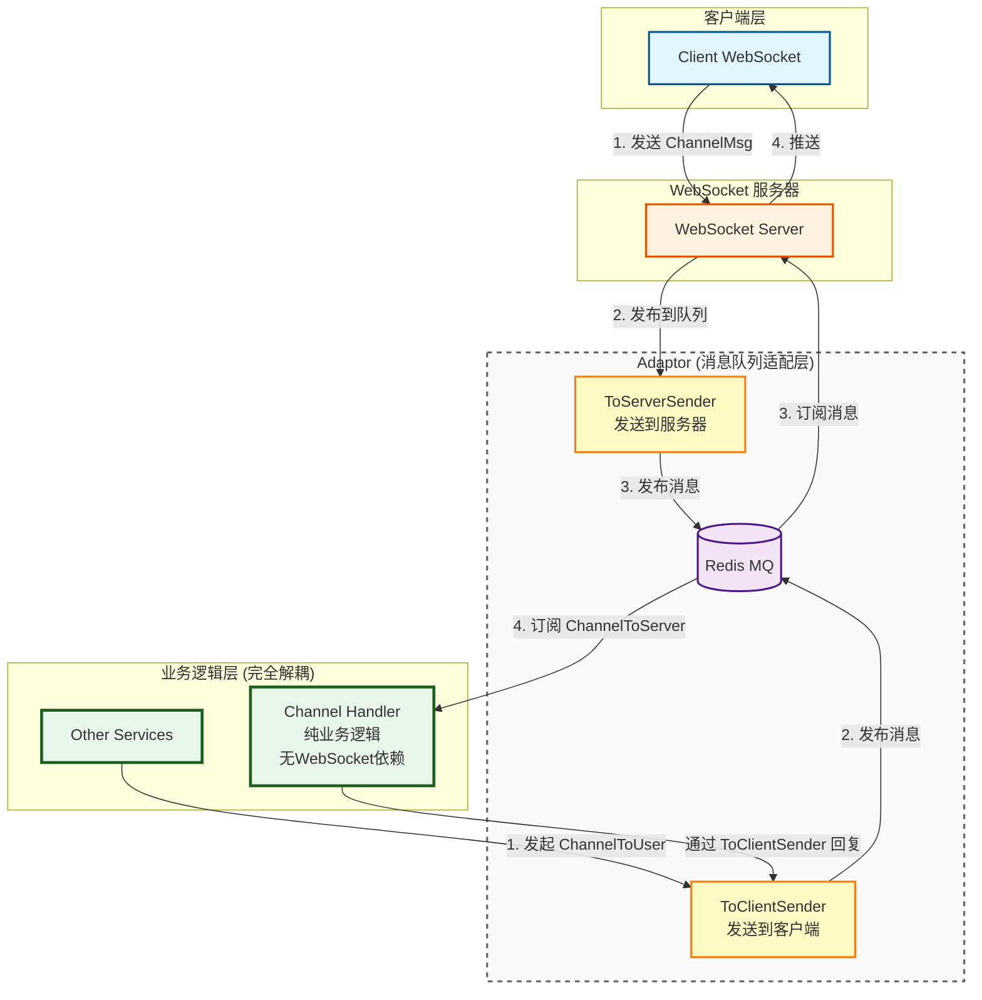

#### 核心概念

**消息类型 (MessageType)**

- `ServerToUserSocket`: 服务器发送给用户的WebSocket消息
- `UserToServerSocket`: 用户通过WebSocket发送给服务器的消息
- `ChannelToServer`: 发送给频道处理器的消息
- `ChannelToUser`: 发送给频道用户的消息
- `ServerToWorker`: 发送给后台任务处理器的消息
- `ChannelOpenCheck`: 请求创建频道的消息
- `ChannelOpenRes`: 频道创建结果的响应
- `SubscribeCheck`: 订阅频道的权限检查
- `SubscribeRes`: 订阅频道的权限检查结果

**消息结构**

```go
type MessageStruct struct {
    Type     MessageType  // 消息类型
    Payload  TopicPayload // 消息载荷
    Priority int          // 优先级
}
```

#### 使用示例

**1. 注册消息处理器**

```go
package handlers

import "go-backend/pkg/messaging"

// 处理频道消息
func handleChannelMessage(message messaging.MessageStruct) error {
    payload := message.Payload.(messaging.ChannelMessagePayLoad)
    
    // 业务逻辑处理
    result := processBusinessLogic(payload.Data)
    
    // 发送响应给用户
    return messaging.SendToClient(payload.UserID, payload.Topic, result)
}

// 注册处理器
func init() {
    messaging.RegisterHandler(messaging.ChannelToServer, handleChannelMessage)
}
```

**2. 发送消息到客户端**

```go
// 从任何服务发送消息到WebSocket客户端
import "go-backend/pkg/messaging"

func NotifyUser(userID uint64, topic string, data interface{}) error {
    return messaging.SendToClient(userID, topic, data)
}

// 广播消息给所有用户
func BroadcastMessage(topic string, data interface{}) error {
    return messaging.Broadcast(topic, data)
}
```

**3. 处理用户消息**

```go
// 接收来自客户端的消息
func handleUserMessage(message messaging.MessageStruct) error {
    payload := message.Payload.(messaging.UserMessagePayload)
    
    // 处理用户请求
    response := processUserRequest(payload.Data)
    
    // 回复用户
    return messaging.SendToClient(payload.UserID, payload.Topic, response)
}
```

#### 优势特性

- **完全解耦**: 业务逻辑无需依赖WebSocket连接
- **水平扩展**: 支持多个WebSocket服务器实例
- **可靠传输**: 基于Redis的消息队列保证消息不丢失
- **优先级队列**: 支持消息优先级处理
- **类型安全**: 强类型消息结构，编译时检查

### pkg/websocket - WebSocket 服务

WebSocket服务提供实时双向通信能力，支持连接管理、频道机制和消息推送。

#### 架构设计

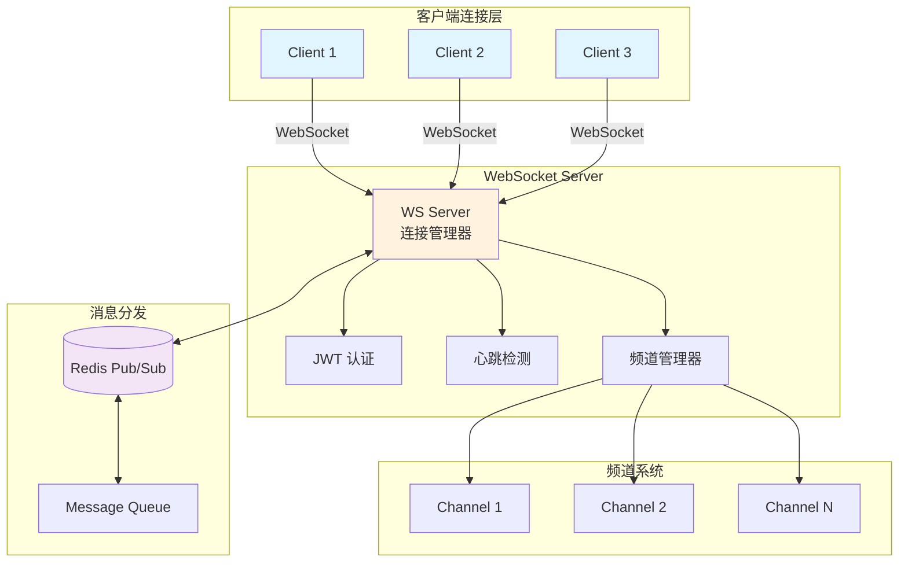

#### 核心功能

**1. 连接管理**

- JWT Token认证
- 连接状态跟踪
- 自动清理过期连接
- 用户多设备支持

**2. 频道机制**

- 动态频道创建
- 权限验证
- 频道订阅/取消订阅
- 频道生命周期管理

**3. 心跳检测**

- Ping/Pong机制
- 连接超时检测
- 自动断线重连

#### 使用示例

**服务端启动**

```go
package main

import (
    "go-backend/pkg/websocket"
    "go-backend/pkg/configs"
)

func main() {
    config := configs.GetConfig()
    
    // 创建WebSocket服务器
    wsServer := websocket.NewWsServer(websocket.WsServerOptions{
        AllowOrigins: config.Socket.AllowOrigins,
        ChannelFactory: channelhandler.GetFactory(),
    })
    
    // 启动服务器
    wsServer.Start(config.Socket.Port)
}
```

**客户端连接**

```javascript
// Web客户端示例
const ws = new WebSocket('ws://localhost:8088/ws?token=' + jwtToken);

ws.onopen = function() {
    console.log('WebSocket连接已建立');
    
    // 订阅频道
    ws.send(JSON.stringify({
        action: 'subscribe',
        topic: 'user.notifications'
    }));
};

ws.onmessage = function(event) {
    const data = JSON.parse(event.data);
    console.log('收到消息:', data);
};

ws.onerror = function(error) {
    console.error('WebSocket错误:', error);
};

ws.onclose = function() {
    console.log('WebSocket连接已关闭');
};
```

**创建自定义频道**

```go
// 创建频道处理器
type MyChannelHandler struct {
    channelhandler.BaseChannelHandler
}

func (h *MyChannelHandler) HandleMessage(channel *channelhandler.IsolateChannel, msg *channelhandler.IsolateChannelMsg) error {
    // 处理频道消息
    data := msg.Data
    
    // 业务逻辑
    result := processData(data)
    
    // 发送响应
    return channel.Send(result)
}

// 注册频道处理器
func init() {
    channelhandler.RegisterHandler("my-channel", &MyChannelHandler{})
}
```

#### 配置选项

```yaml
socket:
  port: "localhost:8088"
  allow_origins: 
    - "http://localhost:3000"
    - "https://example.com"
  ping_timeout: 60  # 心跳超时时间（秒）
  max_message_size: 1048576  # 最大消息大小（字节）
```

### pkg/caching - Redis 缓存服务

Redis缓存服务提供高性能的数据缓存和会话管理功能。

#### 架构设计

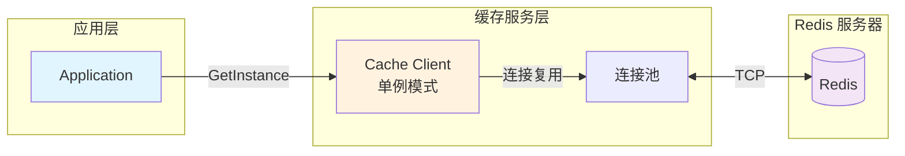

#### 使用示例

**初始化缓存客户端**

```go
import "go-backend/pkg/caching"

func main() {
    config := configs.GetConfig()
    
    // 初始化Redis客户端（单例）
    client := caching.InitInstance(&config.Redis)
    
    // 或者直接使用全局实例
    caching.Client.Set(ctx, "key", "value", time.Hour)
}
```

**基本操作**

```go
import (
    "context"
    "time"
    "go-backend/pkg/caching"
)

func CacheOperations() {
    ctx := context.Background()
    client := caching.GetInstanceUnsafe()
    
    // 设置缓存
    err := client.Set(ctx, "user:1000", userData, 24*time.Hour).Err()
    
    // 获取缓存
    val, err := client.Get(ctx, "user:1000").Result()
    
    // 删除缓存
    err = client.Del(ctx, "user:1000").Err()
    
    // 检查键是否存在
    exists, err := client.Exists(ctx, "user:1000").Result()
    
    // 设置过期时间
    err = client.Expire(ctx, "user:1000", 1*time.Hour).Err()
}
```

**会话管理**

```go
// 存储用户会话
func SaveUserSession(userID uint64, sessionData map[string]interface{}) error {
    ctx := context.Background()
    key := fmt.Sprintf("session:%d", userID)
    
    return caching.Client.HSet(ctx, key, sessionData).Err()
}

// 获取用户会话
func GetUserSession(userID uint64) (map[string]string, error) {
    ctx := context.Background()
    key := fmt.Sprintf("session:%d", userID)
    
    return caching.Client.HGetAll(ctx, key).Result()
}
```

#### 配置选项

```yaml
redis:
  enable: true
  addr: "localhost:6379"
  password: ""
  db: 0
  pool_size: 10
  min_idle_conns: 5
  read_timeout: 3
  write_timeout: 3
  idle_timeout: 300
```

### pkg/database - 数据库连接管理

数据库服务提供统一的数据库访问接口，支持多种数据库类型和自动迁移。

#### 支持的数据库

- **SQLite**: 轻量级嵌入式数据库
- **MySQL**: 最流行的开源数据库
- **PostgreSQL**: 功能强大的开源数据库
- **SQL Server**: 微软企业级数据库
- **Oracle**: 企业级商业数据库
- **ClickHouse**: 高性能列式数据库

#### 使用示例

**初始化数据库**

```go
import "go-backend/pkg/database"

func main() {
    config := configs.GetConfig()
    
    // 创建数据库客户端
    client := database.InitInstance(&config.Database)
    
    // 使用全局实例
    users, err := database.Client.User.Query().All(context.Background())
}
```

**查询操作**

```go
import "go-backend/database/ent"

// 查询所有用户
func GetAllUsers(ctx context.Context) ([]*ent.User, error) {
    return database.Client.User.Query().
        Where(user.IsActive(true)).
        Order(ent.Asc(user.FieldCreatedAt)).
        All(ctx)
}

// 分页查询
func GetUsersPaginated(ctx context.Context, page, pageSize int) ([]*ent.User, error) {
    return database.Client.User.Query().
        Limit(pageSize).
        Offset((page - 1) * pageSize).
        All(ctx)
}

// 关联查询
func GetUserWithRoles(ctx context.Context, userID uint64) (*ent.User, error) {
    return database.Client.User.Query().
        Where(user.ID(userID)).
        WithRoles().
        Only(ctx)
}
```

**创建和更新**

```go
// 创建用户
func CreateUser(ctx context.Context, username, email string) (*ent.User, error) {
    return database.Client.User.Create().
        SetUsername(username).
        SetEmail(email).
        SetIsActive(true).
        Save(ctx)
}

// 更新用户
func UpdateUser(ctx context.Context, userID uint64, updates map[string]interface{}) error {
    return database.Client.User.UpdateOneID(userID).
        SetUsername(updates["username"].(string)).
        SetEmail(updates["email"].(string)).
        Exec(ctx)
}

// 软删除
func DeleteUser(ctx context.Context, userID uint64) error {
    return database.Client.User.UpdateOneID(userID).
        SetDeletedAt(time.Now()).
        Exec(ctx)
}
```

#### 迁移模式

- **auto**: 自动执行数据库迁移
- **check**: 检查但不执行迁移
- **skip**: 跳过迁移检查

```bash
# 启动时指定迁移模式
go run ./cmd/api -m auto   # 自动迁移
go run ./cmd/api -m check  # 仅检查
go run ./cmd/api -m skip   # 跳过检查
```

#### 配置选项

```yaml
database:
  driver: "mysql"  # sqlite3|mysql|postgres|sqlserver|oracle|clickhouse
  dsn: "user:pass@tcp(localhost:3306)/dbname?charset=utf8mb4&parseTime=True"
  max_idle_conns: 10
  max_open_conns: 100
  conn_max_lifetime: 3600  # 秒
  debug: false
  auto_migrate: false
  skip_migrate_check: false
```

### pkg/jwt - JWT 认证服务

JWT服务提供安全的用户认证和令牌管理功能。

#### 使用示例

**初始化JWT服务**

```go
import "go-backend/pkg/jwt"

func main() {
    config := configs.GetConfig()
    
    jwtService := jwt.NewJWTService(
        config.JWT.SecretKey,
        config.JWT.Issuer,
    )
}
```

**生成Token**

```go
// 生成访问令牌
func GenerateAccessToken(userID, clientID uint64) (string, error) {
    return jwtService.GenerateToken(
        userID,
        clientID,
        24*time.Hour,  // 过期时间
        false,         // 是否为刷新令牌
        false,         // 记住我
    )
}

// 生成刷新令牌
func GenerateRefreshToken(userID, clientID uint64) (string, error) {
    return jwtService.GenerateToken(
        userID,
        clientID,
        7*24*time.Hour,  // 7天
        true,            // 是否为刷新令牌
        true,            // 记住我
    )
}
```

**验证Token**

```go
// 验证令牌
func ValidateToken(tokenString string) (*jwt.Claims, error) {
    claims, err := jwtService.ValidateToken(tokenString)
    if err != nil {
        return nil, err
    }
    
    // 使用claims中的信息
    userID := claims.UserID
    clientID := claims.ClientDeviceId
    
    return claims, nil
}
```

**刷新Token**

```go
// 刷新访问令牌
func RefreshAccessToken(refreshToken string, clientID uint64) (string, error) {
    return jwtService.RefreshToken(
        refreshToken,
        clientID,
        24*time.Hour,
    )
}
```

#### Token结构

```go
type Claims struct {
    UserID         uint64  // 用户ID
    ClientDeviceId uint64  // 客户端设备ID
    IsRefresh      bool    // 是否为刷新令牌
    Expiry         uint64  // 过期时间戳
    RememberMe     bool    // 记住我
}
```

#### 配置选项

```yaml
jwt:
  secret_key: "your-secret-key-change-in-production"
  issuer: "qc-admin"
  expire_hours: 24
  refresh_expire_hours: 168  # 7天
```

### pkg/s3 - S3 文件存储服务

S3文件存储服务提供兼容AWS S3协议的对象存储功能，支持文件上传、下载和预签名URL。

#### 支持的存储服务

- **AWS S3**: 亚马逊云存储
- **MinIO**: 开源对象存储
- **阿里云OSS**: 兼容S3协议
- **腾讯云COS**: 兼容S3协议

#### 使用示例

**初始化S3客户端**

```go
import "go-backend/pkg/s3"

func main() {
    config := configs.GetConfig()
    
    // 初始化S3客户端（单例）
    client := s3.InitInstance(&config.S3)
}
```

**上传文件**

```go
import (
    "context"
    "os"
    "go-backend/pkg/s3"
)

// 上传文件
func UploadFile(filePath, key string) error {
    ctx := context.Background()
    client := s3.GetClient()
    
    file, err := os.Open(filePath)
    if err != nil {
        return err
    }
    defer file.Close()
    
    return client.UploadFile(ctx, key, file)
}

// 上传字节数据
func UploadBytes(key string, data []byte) error {
    ctx := context.Background()
    return s3.GetClient().UploadBytes(ctx, key, data)
}
```

**下载文件**

```go
// 下载文件
func DownloadFile(key, destPath string) error {
    ctx := context.Background()
    client := s3.GetClient()
    
    return client.DownloadFile(ctx, key, destPath)
}

// 获取文件内容
func GetFileContent(key string) ([]byte, error) {
    ctx := context.Background()
    return s3.GetClient().GetObject(ctx, key)
}
```

**生成预签名URL**

```go
// 生成上传URL（客户端直传）
func GenerateUploadURL(key string) (string, error) {
    ctx := context.Background()
    client := s3.GetClient()
    
    return client.PresignPutObject(ctx, key, 15*time.Minute)
}

// 生成下载URL
func GenerateDownloadURL(key string) (string, error) {
    ctx := context.Background()
    return s3.GetClient().PresignGetObject(ctx, key, 1*time.Hour)
}
```

#### 配置选项

```yaml
s3:
  endpoint: "https://s3.amazonaws.com"  # MinIO: http://localhost:9000
  region: "us-east-1"
  bucket: "qc-admin-files"
  access_key: "your-access-key"
  secret_key: "your-secret-key"
  session_token: ""  # 可选
  force_path_style: false  # MinIO需要设置为true
```

### pkg/email - 邮件发送服务

邮件服务提供邮件发送和模板管理功能，支持HTML邮件和附件。

#### 使用示例

**初始化邮件客户端**

```go
import "go-backend/pkg/email"

func main() {
    config := configs.GetConfig()
    
    // 初始化邮件客户端
    err := email.InitializeClient(&config.Email)
}
```

**发送简单邮件**

```go
// 发送文本邮件
func SendTextEmail(to, subject, body string) error {
    client := email.GetClient()
    
    return client.SendEmail(email.EmailMessage{
        To:      []string{to},
        Subject: subject,
        Body:    body,
    })
}

// 发送HTML邮件
func SendHTMLEmail(to, subject, htmlBody string) error {
    client := email.GetClient()
    
    return client.SendHTMLEmail(email.EmailMessage{
        To:      []string{to},
        Subject: subject,
        Body:    htmlBody,
    })
}
```

**使用模板发送邮件**

```go
// 使用模板发送验证码邮件
func SendVerifyCodeEmail(to, code string) error {
    client := email.GetClient()
    
    data := map[string]interface{}{
        "Code":       code,
        "ExpireTime": "10分钟",
    }
    
    return client.SendTemplateEmail(
        []string{to},
        "验证码",
        "verify-code",
        data,
    )
}
```

**发送带附件的邮件**

```go
func SendEmailWithAttachment(to, subject, body string, attachments []string) error {
    client := email.GetClient()
    
    return client.SendEmailWithAttachments(email.EmailMessage{
        To:          []string{to},
        Subject:     subject,
        Body:        body,
        Attachments: attachments,
    })
}
```

#### 模板系统

邮件模板使用Go的`html/template`引擎，放置在配置的模板目录中。

**模板示例** (`templates/verify-code.html`):

```html
<!DOCTYPE html>
<html>
<head>
    <meta charset="UTF-8">
    <title>验证码</title>
</head>
<body>
    <h2>您的验证码</h2>
    <p>您的验证码是: <strong>{{.Code}}</strong></p>
    <p>该验证码将在{{.ExpireTime}}后过期。</p>
    <p>如果这不是您的操作，请忽略此邮件。</p>
</body>
</html>
```

#### 配置选项

```yaml
email:
  host: "smtp.gmail.com"
  port: 587
  username: "your-email@gmail.com"
  password: "your-app-password"
  from: "QC Admin <noreply@example.com>"
  use_tls: true
  use_ssl: false
  template_dir: "./templates"
```

### pkg/sms - 短信发送服务

短信服务提供多平台短信发送功能，支持动态切换服务商。

#### 支持的短信平台

- **阿里云短信**
- **腾讯云短信**
- **华为云短信**
- **Mock模式**（开发测试用）

#### 使用示例

**初始化短信客户端**

```go
import "go-backend/pkg/sms"

func main() {
    config := configs.GetConfig()
    
    // 初始化短信客户端
    err := sms.InitializeClient(&config.SMS)
}
```

**发送短信**

```go
// 发送验证码
func SendVerifyCodeSMS(phone, code string) error {
    client := sms.GetClient()
    
    return client.SendSMS(sms.SMSMessage{
        PhoneNumbers: []string{phone},
        TemplateCode: "SMS_123456",
        TemplateParams: map[string]string{
            "code": code,
        },
    })
}

// 批量发送
func SendBatchSMS(phones []string, message string) error {
    client := sms.GetClient()
    
    return client.SendBatchSMS(sms.SMSMessage{
        PhoneNumbers: phones,
        TemplateCode: "SMS_TEMPLATE",
        TemplateParams: map[string]string{
            "message": message,
        },
    })
}
```

**动态切换服务商**

```go
// 切换到腾讯云
func SwitchToTencentCloud() error {
    client := sms.GetClient()
    return client.SwitchProvider(sms.ProviderTencent)
}
```

#### 配置选项

```yaml
sms:
  provider: "aliyun"  # aliyun|tencent|huawei|mock
  access_key: "your-access-key"
  secret_key: "your-secret-key"
  sign_name: "QC Admin"
  region: "cn-hangzhou"
```

### pkg/excel - Excel 导出服务

Excel服务提供数据导出为Excel文件的功能，支持自定义样式和格式。

#### 使用示例

**定义列配置**

```go
import "go-backend/pkg/excel"

// 定义用户列表导出配置
func GetUserColumns() []excel.ColumnConfig {
    return []excel.ColumnConfig{
        {
            Header:    "用户ID",
            Width:     15,
            FieldName: "ID",
        },
        {
            Header:    "用户名",
            Width:     20,
            FieldName: "Username",
        },
        {
            Header:    "邮箱",
            Width:     30,
            FieldName: "Email",
        },
        {
            Header:    "创建时间",
            Width:     20,
            FieldName: "CreatedAt",
            Formatter: func(v any) string {
                if t, ok := v.(time.Time); ok {
                    return t.Format("2006-01-02 15:04:05")
                }
                return ""
            },
        },
    }
}
```

**导出数据**

```go
// 导出用户列表
func ExportUsers(users []*ent.User) (*excelize.File, error) {
    processor := excel.NewExcelProcessor("用户列表", GetUserColumns())
    
    return processor.GenerateExcelStream(users)
}

// 保存到文件
func SaveExcel(file *excelize.File, filename string) error {
    return file.SaveAs(filename)
}
```

**HTTP响应导出**

```go
// 在Gin中返回Excel文件
func ExportUsersHandler(c *gin.Context) {
    users, _ := GetAllUsers()
    
    file, err := ExportUsers(users)
    if err != nil {
        c.JSON(500, gin.H{"error": err.Error()})
        return
    }
    
    c.Header("Content-Type", "application/vnd.openxmlformats-officedocument.spreadsheetml.sheet")
    c.Header("Content-Disposition", "attachment; filename=users.xlsx")
    
    file.Write(c.Writer)
}
```

### pkg/logging - 日志服务

日志服务提供结构化日志记录功能，支持多级别和彩色输出。

#### 日志级别

- **DEBUG**: 调试信息
- **INFO**: 一般信息
- **WARN**: 警告信息
- **ERROR**: 错误信息
- **FATAL**: 致命错误

#### 使用示例

**基本日志记录**

```go
import "go-backend/pkg/logging"

func BusinessLogic() {
    // 调试日志
    logging.Debug("Processing user request: userID=%d", userID)
    
    // 信息日志
    logging.Info("User logged in: %s", username)
    
    // 警告日志
    logging.Warn("Rate limit approaching: %d requests", count)
    
    // 错误日志
    logging.Error("Failed to save data: %v", err)
    
    // 致命错误（会退出程序）
    logging.Fatal("Database connection lost: %v", err)
}
```

**创建组件Logger**

```go
// 为特定组件创建logger
logger := logging.WithName("UserService")

logger.Info("Starting user service")
logger.Debug("Loading configuration")
logger.Error("Service error: %v", err)
```

**设置日志级别**

```go
// 在应用启动时设置
func init() {
    logging.SetLogLevel(logging.INFO)  // 只显示INFO及以上级别
}
```

#### 配置选项

```yaml
logging:
  level: "info"  # debug|info|warn|error|fatal
  format: "text"  # text|json
  output: "stdout"  # stdout|file
  file_path: "./logs/app.log"
```

### pkg/configs - 配置管理服务

配置管理服务提供统一的配置加载和管理功能，支持多环境和配置导入。

#### 使用示例

**加载配置**

```go
import "go-backend/pkg/configs"

func main() {
    // 加载配置文件
    config, err := configs.LoadConfig("config.yaml")
    if err != nil {
        log.Fatal(err)
    }
    
    // 使用配置
    serverPort := config.Server.Port
    dbDriver := config.Database.Driver
}
```

**获取全局配置**

```go
// 在应用的任何地方获取配置
config := configs.GetConfig()

// 访问各个配置项
redisAddr := config.Redis.Addr
jwtSecret := config.JWT.SecretKey
s3Bucket := config.S3.Bucket
```

**配置导入功能**

配置文件支持导入其他配置文件，用于管理敏感信息或环境特定配置。

**主配置文件** (`config.yaml`):

```yaml
config:
  import:
    - "file:config.private.yaml"  # 导入私有配置（不提交到Git）
    - "file:config.${ENV}.yaml"   # 导入环境特定配置

server:
  host: "localhost"
  port: "8080"
  mode: "debug"
```

**私有配置文件** (`config.private.yaml`):

```yaml
database:
  dsn: "user:password@tcp(localhost:3306)/dbname"

redis:
  password: "redis-password"

s3:
  access_key: "access-key"
  secret_key: "secret-key"

jwt:
  secret_key: "jwt-secret-key"
```

#### 环境变量支持

配置支持通过环境变量覆盖：

```bash
# 设置环境变量
export APP_SERVER_PORT=8081
export APP_DATABASE_DRIVER=postgres
export APP_JWT_SECRET_KEY=new-secret

# 启动应用（会自动读取环境变量）
go run ./cmd/api
```

#### 配置结构

```go
type AppConfig struct {
    Server   ServerConfig   // 服务器配置
    Database DatabaseConfig // 数据库配置
    Logging  LoggingConfig  // 日志配置
    Redis    RedisConfig    // Redis配置
    S3       S3Config       // S3配置
    Email    EmailConfig    // 邮件配置
    SMS      SMSConfig      // 短信配置
    JWT      JWTConfig      // JWT配置
    OpenAI   OpenAIConfig   // OpenAI配置
    Socket   SocketConfig   // WebSocket配置
}
```

### pkg/channel_handler - 频道处理器

频道处理器提供WebSocket频道的生命周期管理和消息处理功能。

#### 核心概念

**频道生命周期**

```go
const (
    Channel_Init     = iota  // 初始化
    Channel_Opening          // 打开中
    Channel_Running          // 运行中
    Channel_Closing          // 关闭中
    Channel_Closed           // 已关闭
)
```

#### 使用示例

**创建频道处理器**

```go
import "go-backend/pkg/channel_handler"

type MyChannelHandler struct {
    channelhandler.BaseChannelHandler
}

// 实现处理方法
func (h *MyChannelHandler) HandleMessage(
    channel *channelhandler.IsolateChannel,
    msg *channelhandler.IsolateChannelMsg,
) error {
    // 获取消息数据
    data := msg.Data
    
    // 处理业务逻辑
    result := processBusinessLogic(data)
    
    // 发送响应
    if err := channel.Send(result); err != nil {
        return channel.Error(err)
    }
    
    return nil
}

// 频道创建时调用
func (h *MyChannelHandler) OnCreate(channel *channelhandler.IsolateChannel) error {
    h.Logger.Info("Channel created: %s", channel.ID)
    return nil
}

// 频道关闭时调用
func (h *MyChannelHandler) OnClose(channel *channelhandler.IsolateChannel) error {
    h.Logger.Info("Channel closed: %s", channel.ID)
    return nil
}
```

**注册频道处理器**

```go
func init() {
    factory := channelhandler.GetFactory()
    
    // 注册处理器
    factory.RegisterHandler("chat", &ChatChannelHandler{})
    factory.RegisterHandler("notification", &NotificationChannelHandler{})
}
```

**频道操作**

```go
// 读取消息
msg, err := channel.Read()

// 非阻塞读取
msg, ok := channel.TryRead()

// 发送消息
err := channel.Send(data)

// 发送错误
err := channel.Error(errors.New("processing failed"))

// 关闭频道
err := channel.Close()

// 获取频道状态
status := channel.GetStatus()
```

### pkg/utils - 工具函数库

工具函数库提供各种常用的辅助函数。

#### 主要功能模块

**ID生成器**

```go
import "go-backend/pkg/utils"

// 生成唯一ID（基于Snowflake）
id := utils.GenerateID()

// 生成UUID
uuid := utils.GenerateUUID()
```

**加密工具**

```go
// Argon2密码加密
hashedPassword := utils.HashPassword("password123")

// 验证密码
isValid := utils.VerifyPassword("password123", hashedPassword)
```

**时间工具**

```go
// 格式化时间
timeStr := utils.FormatTime(time.Now(), "2006-01-02 15:04:05")

// 解析时间
t, err := utils.ParseTime("2024-01-01 12:00:00")

// 获取时间范围
startOfDay := utils.StartOfDay(time.Now())
endOfDay := utils.EndOfDay(time.Now())
```

**字符串工具**

```go
// 生成随机字符串
randomStr := utils.RandomString(10)

// 生成数字验证码
code := utils.RandomNumberString(6)

// 字符串截断
truncated := utils.Truncate("long string", 10)
```

**切片工具**

```go
// 切片去重
unique := utils.UniqueSlice([]int{1, 2, 2, 3, 3, 4})

// 切片包含检查
contains := utils.Contains([]string{"a", "b", "c"}, "b")

// 切片差集
diff := utils.DiffSlice(slice1, slice2)
```

**JSON工具**

```go
// 结构体转JSON字符串
jsonStr := utils.ToJSONString(data)

// JSON字符串转结构体
var result MyStruct
err := utils.FromJSONString(jsonStr, &result)

// 美化JSON
prettyJSON := utils.PrettyJSON(data)
```

**HTTP工具**

```go
// 发送GET请求
response, err := utils.HTTPGet("https://api.example.com/data")

// 发送POST请求
response, err := utils.HTTPPost("https://api.example.com/data", payload)

// 下载文件
err := utils.DownloadFile("https://example.com/file.pdf", "./file.pdf")
```

**文件工具**

```go
// 检查文件是否存在
exists := utils.FileExists("./config.yaml")

// 读取文件内容
content, err := utils.ReadFile("./data.txt")

// 写入文件
err := utils.WriteFile("./output.txt", data)

// 获取文件大小
size := utils.FileSize("./file.dat")
```

## 🏗️ 开发指南

### 添加新的API接口

1. **定义数据模型** (database/schema/)

```go
// database/schema/product.go
package schema

import (
    "go-backend/database/mixins"
    "entgo.io/ent"
    "entgo.io/ent/schema/field"
)

type Product struct {
    ent.Schema
}

func (Product) Mixin() []ent.Mixin {
    return []ent.Mixin{
        mixins.BaseMixin{},
    }
}

func (Product) Fields() []ent.Field {
    return []ent.Field{
        field.String("name").NotEmpty(),
        field.String("description").Optional(),
        field.Float("price").Positive(),
    }
}
```

2. **生成ORM代码**

```bash
go generate ./database/generate.go
```

3. **创建业务逻辑** (internal/funcs/)

```go
// internal/funcs/product_func.go
package funcs

func CreateProduct(ctx context.Context, req CreateProductRequest) (*ent.Product, error) {
    return client.Product.Create().
        SetName(req.Name).
        SetDescription(req.Description).
        SetPrice(req.Price).
        Save(ctx)
}
```

4. **创建HTTP处理器** (internal/handlers/)

```go
// internal/handlers/product_handler.go
package handlers

func (h *ProductHandler) CreateProduct(c *gin.Context) {
    var req CreateProductRequest
    if err := c.ShouldBindJSON(&req); err != nil {
        middleware.ThrowError(c, middleware.ValidationError("参数错误", err.Error()))
        return
    }
    
    product, err := funcs.CreateProduct(middleware.GetRequestContext(c), req)
    if err != nil {
        middleware.ThrowError(c, middleware.BusinessError("创建失败", err.Error()))
        return
    }
    
    c.JSON(200, gin.H{"success": true, "data": product})
}
```

5. **注册路由** (internal/routes/)

```go
// internal/routes/product.go
package routes

func RegisterProductRoutes(r *gin.RouterGroup) {
    handler := handlers.NewProductHandler()
    
    products := r.Group("/products")
    {
        products.GET("", handler.GetProducts)
        products.POST("", handler.CreateProduct)
        products.GET("/:id", handler.GetProduct)
        products.PUT("/:id", handler.UpdateProduct)
        products.DELETE("/:id", handler.DeleteProduct)
    }
}
```

### 添加WebSocket消息处理

1. **创建消息处理器** (cmd/socket/handlers/)

```go
// cmd/socket/handlers/custom_handler.go
func handleCustomMessage(message messaging.MessageStruct) error {
    // 处理自定义消息逻辑
    return nil
}

func registerCustomHandler(ws *websocket.WsServer) {
    messaging.RegisterHandler("custom_topic", handleCustomMessage)
}
```

2. **注册处理器**

```go
// cmd/socket/handlers/handlers.go
func RegisterHandlers(ws *websocket.WsServer) {
    registerSocketHandler(ws)
    registerCustomHandler(ws)  // 添加新的处理器
}
```

### 数据库迁移

项目使用Ent ORM的自动迁移功能：

```go
// 在应用启动时自动迁移
if err := client.Schema.Create(context.Background()); err != nil {
    log.Fatalf("failed creating schema resources: %v", err)
}
```

### 添加中间件

```go
// internal/middleware/custom.go
package middleware

func CustomMiddleware() gin.HandlerFunc {
    return func(c *gin.Context) {
        // 中间件逻辑
        c.Next()
    }
}
```

## 🧪 测试

- [架构设计文档](./ARCHITECTURE.md) - 深入的技术架构说明
- [认证开发总结](./AUTH_DEVELOPMENT_SUMMARY.md) - 认证系统详细说明
- [RBAC实现总结](./RBAC_IMPLEMENTATION_SUMMARY.md) - 权限系统实现细节
- [Excel导出说明](./README_EXCEL_EXPORT.md) - Excel功能使用说明
- [文件上传API](./README_UPLOAD_API.md) - 文件上传接口文档
- [数据库驱动支持](./DATABASE_DRIVERS.md) - 数据库驱动配置说明

## 🤝 贡献指南

欢迎贡献代码！请遵循以下步骤：

1. Fork 项目
2. 创建功能分支 (`git checkout -b feature/AmazingFeature`)
3. 提交更改 (`git commit -m 'Add some AmazingFeature'`)
4. 推送到分支 (`git push origin feature/AmazingFeature`)
5. 打开 Pull Request

### 代码规范

- 遵循Go官方代码规范
- 使用 `gofmt` 格式化代码
- 添加必要的注释和文档
- 确保测试通过
- 提交消息请使用英文，格式清晰

## 📄 许可证

本项目采用 [MIT 许可证](LICENSE)。

## 🙏 致谢

感谢以下开源项目：

- [Gin Web Framework](https://github.com/gin-gonic/gin)
- [Ent ORM](https://entgo.io/)
- [Viper](https://github.com/spf13/viper)
- [Redis](https://redis.io/)
- [Go语言社区](https://golang.org/)

---

如有问题或建议，请创建 [Issue](https://github.com/your-username/qc-admin-go-backend/issues)。
